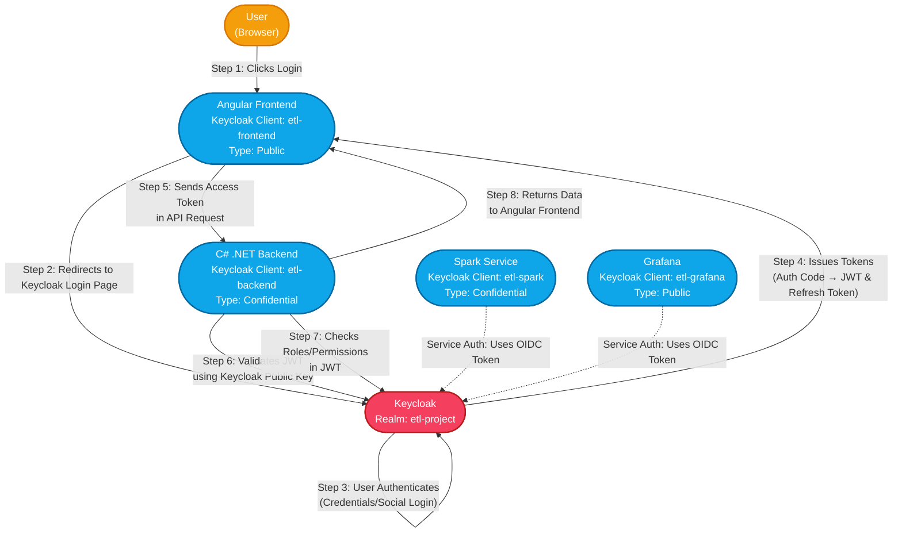

# Keycloak Authentication Flow in ETL Project (Angular + .NET)

This guide explains how user authentication and service authorization work in our ETL pipeline using **Keycloak**. Keycloak is an open-source Identity and Access Management (IAM) solution that provides Single Sign-On (SSO), user federation, and centralized RBAC (Role-Based Access Control) for all our services.

---

## What is Keycloak?

**Keycloak** is an open-source Identity and Access Management (IAM) tool.  
It provides Single Sign-On (SSO), user federation, and centralized Role-Based Access Control (RBAC) for applications and services.

- **Realm**: A logical grouping of users, roles, and clients (apps/services).
- **Client**: An application or service that uses Keycloak for authentication (e.g., your Angular frontend, .NET backend).
- **Public Client**: Used by browser apps (no secret).
- **Confidential Client**: Used by backend/services (requires secret).
- **Roles**: Used for fine-grained access control (RBAC).
- **Users**: Created by administrators, assigned roles, and can change their own password.

---

## How to Set Up Keycloak for Your ETL Project

### Step 1: Access Keycloak Admin UI

1. **Open your browser** and go to your Keycloak server URL (e.g., `https://your-keycloak-domain:8443`).
2. **Login** with your Keycloak admin username and password.

---

### Step 2: Create a Realm

A **realm** is like a workspace for your project’s users, roles, and clients.

1. In the left sidebar, click **"Realms"**.
2. Click **"Add realm"** (top right).
3. Enter a **name** for your realm (e.g., `etl-project`).
4. Click **"Create"**.

**Best Practice:**  

- Use a unique, descriptive name for each project or environment (e.g., `etl-dev`, `etl-prod`).

---

### Step 3: Create a Client (for Angular Frontend)

A **client** represents your application in Keycloak.

1. In your new realm, click **"Clients"** in the sidebar.
2. Click **"Create client"**.
3. Enter a **Client ID** (e.g., `etl-frontend`).
4. Choose **Client Type**:  
   - Select **OpenID Connect** (recommended for modern web apps).
5. Click **"Next"**.

#### Configure Client Settings

- **Root URL**: Enter your frontend app’s URL (e.g., `https://your-frontend-domain/`).
- **Valid Redirect URIs**:  
  - Add the URLs where Keycloak can send users after login (e.g., `https://your-frontend-domain/*`).
- **Web Origins**:  
  - Add your frontend’s domain (e.g., `https://your-frontend-domain`).

**Client Authentication:**  

- For browser apps, set **"Client authentication"** to **OFF** (makes it a **public client**).

**Best Practice:**  

- Use wildcards (`*`) carefully; restrict to only necessary URLs for security.

---

### Step 4: Create a Client (for .NET Backend)

1. Click **"Clients"** > **"Create client"**.
2. Enter **Client ID** (e.g., `etl-backend`).
3. Choose **Client Type**: **OpenID Connect**.
4. Click **"Next"**.

#### Configure Backend Client

- **Root URL**: Enter your backend API’s URL (e.g., `https://your-backend-domain/api`).
- **Valid Redirect URIs**:  
  - For APIs, this is often not needed; you can use `https://your-backend-domain/*`.
- **Web Origins**:  
  - Add your backend’s domain.

**Client Authentication:**  

- For backend services, set **"Client authentication"** to **ON** (makes it a **confidential client**).
- Keycloak will generate a **client secret**—copy this and use it in your backend configuration.

**Best Practice:**  

- Keep client secrets secure; never expose them in frontend code or public repos.

---

### Step 5: Create Additional Clients (Spark, Grafana)

- Repeat the above steps for each service:
  - **Spark**: Usually a confidential client.
  - **Grafana**: Usually a public client for browser SSO.

---

### Step 6: Assign Roles (Optional but Recommended)

1. In the sidebar, click **"Roles"**.
2. Click **"Add role"**.
3. Name your roles (e.g., `System Administrator`, `Data Manager`, `Analyst`).
4. Assign roles to users as needed.

**Best Practice:**  

- Use roles for fine-grained access control (RBAC).

---

### Step 7: Add Users

1. Click **"Users"** in the sidebar.
2. Click **"Add user"**.
3. Fill in user details and save.
4. Set a password for the user (Actions > Set password).
5. Assign roles to users.

---

### Step 8: Test Your Setup

- Use your Angular frontend to log in.
- Ensure tokens are issued and API calls to your .NET backend are authenticated.

---

## Step-by-Step Authentication Flow

### 1. User Clicks "Login"

- The user opens the **Frontend** (Angular app) and clicks the "Login" button.
- The Angular app is configured with the Keycloak client ID `etl-frontend` and uses the Keycloak realm `etl-project`.

### 2. Redirect to Keycloak

- The Angular app redirects the user's browser to the Keycloak login page for the `etl-project` realm.
- This uses the OpenID Connect (OIDC) protocol, a modern standard for authentication.

### 3. Authentication

- The user enters their credentials (username/password) or uses a social login (if enabled) on the Keycloak login page.
- Keycloak verifies the credentials against its user database (stored in PostgreSQL).

### 4. Keycloak Issues Tokens

- After successful login, Keycloak redirects the user back to the Angular app with an **Authorization Code**.
- The Angular app exchanges this code for a set of tokens:
  - **Access Token (JWT)**: Short-lived, contains user identity and permissions (roles/groups). Used to prove who the user is.
  - **Refresh Token**: Long-lived, used to get a new Access Token when the old one expires.

### 5. Calling the API

- The Angular app wants to fetch user data from the **Backend** (C# .NET API).
- It adds the Access Token to the HTTP request's `Authorization: Bearer <access_token>` header and sends it to the backend.

### 6. Backend Validation

- The backend is registered as a confidential client (`etl-backend`) in Keycloak.
- When it receives a request, it must verify the Access Token:
  - **JWT Verification**: The .NET backend fetches Keycloak’s public key and verifies the token signature locally. This ensures the token is authentic and untampered.
    - In .NET, this is typically done using libraries like `Microsoft.IdentityModel.Tokens` or `IdentityServer4.AccessTokenValidation`.
  - **Introspection (optional)**: The backend can also ask Keycloak if the token is still valid via a special endpoint.

### 7. Authorization Check

- The backend decodes the JWT to check the user's identity and permissions.
- It checks if the user has the required roles (e.g., `System Administrator`, `Data Manager`, `Analyst`) to access the requested resource.

### 8. Sending Response

- If the user is authorized, the backend fetches the requested data and sends a successful response back to the Angular app.
- If not, it returns an error (e.g., 403 Forbidden).

---

## Service-to-Service Authentication

Other services (like **Spark** and **Grafana**) also use Keycloak clients (`etl-spark`, `etl-grafana`) for secure authentication and SSO:

- **Spark**: Uses a confidential client for secure job submission.
- **Grafana**: Uses a public client for dashboard SSO.

---

## Key Concepts Explained

- **Keycloak Realm**: Logical grouping of users, roles, and clients. We use `etl-project`.
- **Client**: Represents an application (frontend, backend, Spark, Grafana) that uses Keycloak for authentication.
  - **Public Client**: Used by browser apps (no secret).
  - **Confidential Client**: Used by backend/services (requires secret).
- **JWT (JSON Web Token)**: Secure, signed token containing user info and permissions.
- **OIDC (OpenID Connect)**: Protocol for authentication built on OAuth2.
- **RBAC (Role-Based Access Control)**: Controls what users can do based on their assigned roles.

---

## Best Practices

- **Never expose confidential client secrets in frontend code.**
- **Use HTTPS for all communication between services and Keycloak.**
- **Regularly rotate secrets and review user roles.**
- **Monitor authentication logs for suspicious activity.**
- **Use Keycloak’s built-in RBAC for fine-grained access control.**

---

## Security Considerations

- Always use **HTTPS** for Keycloak and your apps.
- Restrict **redirect URIs** and **web origins** to trusted domains.
- Regularly review and rotate client secrets.
- Monitor Keycloak logs for suspicious activity.

---

## Common Pitfalls

- **Token Expiry**: Always handle token refresh in frontend apps.
- **Misconfigured Clients**: Ensure each service uses its own Keycloak client.
- **Misconfigured redirect URIs**: Users may get errors after login.
- **Exposing client secrets**: Only backend/services should use confidential clients.
- **Missing HTTPS**: Never use Keycloak over plain HTTP in production.

---

## Keycloak Authentication Flow Diagram (Angular + .NET)

---

## Follow-Up Learning Resources

- [Keycloak Documentation](https://www.keycloak.org/documentation)
- [Keycloak Admin Guide](https://www.keycloak.org/docs/latest/server_admin/)
- [Keycloak Client Setup](https://www.keycloak.org/docs/latest/server_admin/#oidc-clients)
- [OIDC vs SAML](https://auth0.com/docs/authenticate/protocols/oidc)
- [OpenID Connect Overview](https://openid.net/connect/)
- [JWT Introduction](https://jwt.io/introduction/)
- [RBAC in Keycloak](https://www.keycloak.org/docs/latest/server_admin/#roles)
- [.NET JWT Authentication](https://learn.microsoft.com/en-us/aspnet/core/security/authentication/jwt)
- [Angular Keycloak Integration Example](https://www.npmjs.com/package/keycloak-angular)
