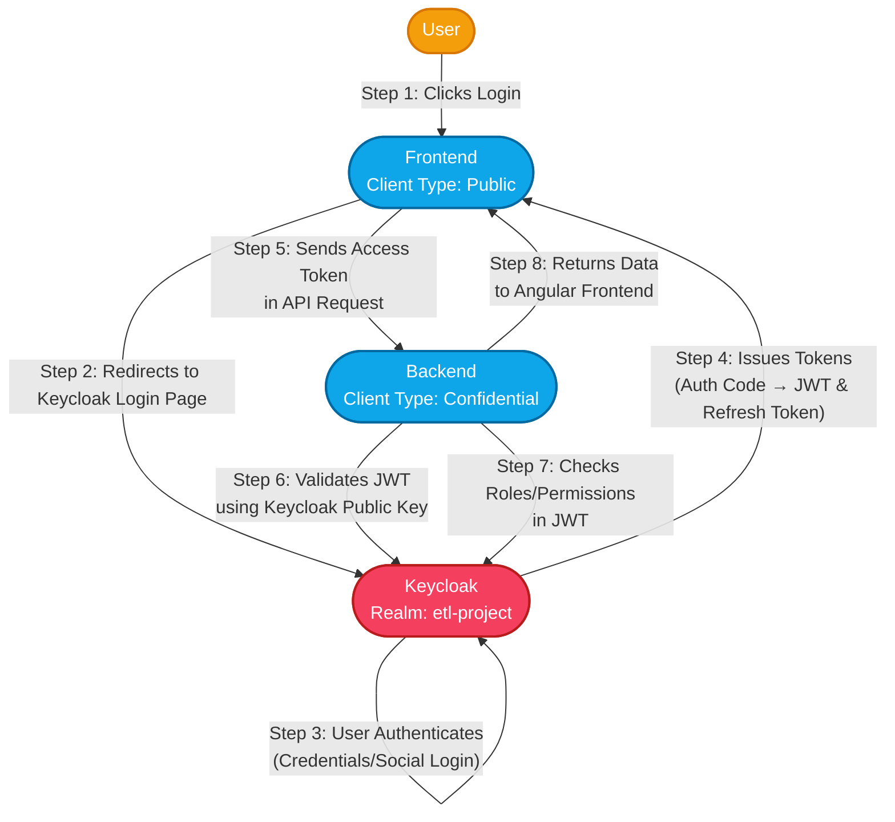

# Keycloak

## What is Keycloak?

**Keycloak** is an open-source Identity and Access Management (IAM) platform.  
It provides centralized authentication, authorization, and user management for applications and services.

- **Why use Keycloak?**  
  - To enable Single Sign-On (SSO) across multiple apps.
  - To manage users, roles, and permissions in one place.
  - To secure APIs and web apps using modern protocols (OIDC, OAuth2, SAML).

---

## Keycloak Access Management Options

### 1. **Authentication**

**Authentication** is the process of verifying a user’s identity (e.g., login with username/password).

- **Single Sign-On (SSO):**  
  Users log in once and gain access to all connected apps.
- **Protocols Supported:**  
  - **OpenID Connect (OIDC):** Modern protocol for web/mobile apps.
  - **OAuth2:** For API authorization.
  - **SAML:** For legacy enterprise integrations.
- **Multi-Factor Authentication (MFA):**  
  Add extra security (e.g., OTP, SMS, email).

### 2. **Authorization**

**Authorization** determines what users can do after they log in.

- **Role-Based Access Control (RBAC):**  
  Assign roles (e.g., admin, analyst, user) to users and restrict access based on roles.
- **Fine-Grained Permissions:**  
  Define policies for resources, actions, and conditions.
- **Groups:**  
  Organize users into groups for bulk role assignment.

### 3. **Clients**

A **client** is any app or service that uses Keycloak for authentication.

- **Public Client:**  
  Used by browser-based apps (no secret required).
- **Confidential Client:**  
  Used by backend/services (requires a secret for secure communication).

### 4. **Identity Brokering & Federation**

- **Identity Brokering:**  
  Allow users to log in using external providers (Google, GitHub, LDAP, etc.).
- **User Federation:**  
  Connect Keycloak to existing user stores (LDAP, Active Directory).

---

## Keycloak Identity Management Features

### 1. **User Management**

- **User Creation:**  
  Admins can create, update, and delete users.
- **Self-Service:**  
  Users can register, reset passwords, and manage their profiles.
- **Attributes:**  
  Store custom data (e.g., department, phone number).

### 2. **Groups and Roles**

- **Groups:**  
  Logical collections of users (e.g., “Data Team”).
- **Roles:**  
  Define permissions (e.g., “System Administrator”, “Data Manager”, “Analyst”).
- **Composite Roles:**  
  Combine multiple roles for complex access scenarios.

### 3. **Credential Management**

- **Password Policies:**  
  Enforce complexity, expiration, and history.
- **Credential Types:**  
  Password, OTP, certificates, social logins.

### 4. **Audit and Monitoring**

- **Event Logging:**  
  Track logins, failed attempts, admin actions.
- **Admin Console:**  
  Web UI for managing realms, users, roles, and clients.

---

## How Keycloak Fits in Real-World DevOps

- **Centralizes user and access management for all services.**
- **Enables secure, scalable authentication and authorization.**
- **Supports integration with CI/CD, monitoring, and data platforms.**
- **Reduces risk by enforcing consistent security policies.**

---

## Step-by-Step Authentication Flow

### 1. User Clicks "Login"

- The user opens the **Frontend** (Angular app) and clicks the "Login" button.
- The Angular app is configured with the Keycloak client ID `etl-frontend` and uses the Keycloak realm `etl-project`.

### 2. Redirect to Keycloak

- The Angular app redirects the user's browser to the Keycloak login page for the `etl-project` realm.
- This uses the OpenID Connect (OIDC) protocol, a modern standard for authentication.

### 3. Authentication

- The user enters their credentials (username/password) or uses a social login (if enabled) on the Keycloak login page.
- Keycloak verifies the credentials against its user database (stored in PostgreSQL).

### 4. Keycloak Issues Tokens

- After successful login, Keycloak redirects the user back to the Angular app with an **Authorization Code**.
- The Angular app exchanges this code for a set of tokens:
  - **Access Token (JWT)**: Short-lived, contains user identity and permissions (roles/groups). Used to prove who the user is.
  - **Refresh Token**: Long-lived, used to get a new Access Token when the old one expires.

### 5. Calling the API

- The Angular app wants to fetch user data from the **Backend** (C# .NET API).
- It adds the Access Token to the HTTP request's `Authorization: Bearer <access_token>` header and sends it to the backend.

### 6. Backend Validation

- The backend is registered as a confidential client (`etl-backend`) in Keycloak.
- When it receives a request, it must verify the Access Token:
  - **JWT Verification**: The .NET backend fetches Keycloak’s public key and verifies the token signature locally. This ensures the token is authentic and untampered.
    - In .NET, this is typically done using libraries like `Microsoft.IdentityModel.Tokens` or `IdentityServer4.AccessTokenValidation`.
  - **Introspection (optional)**: The backend can also ask Keycloak if the token is still valid via a special endpoint.

### 7. Authorization Check

- The backend decodes the JWT to check the user's identity and permissions.
- It checks if the user has the required roles (e.g., `System Administrator`, `Data Manager`, `Analyst`) to access the requested resource.

### 8. Sending Response

- If the user is authorized, the backend fetches the requested data and sends a successful response back to the Angular app.
- If not, it returns an error (e.g., 403 Forbidden).

---

## Service-to-Service Authentication

Other services (like **Spark** and **Grafana**) also use Keycloak clients (`etl-spark`, `etl-grafana`) for secure authentication and SSO:

- **Spark**: Uses a confidential client for secure job submission.
- **Grafana**: Uses a public client for dashboard SSO.

---

## Key Concepts Explained

- **Keycloak Realm**: Logical grouping of users, roles, and clients. We use `etl-project`.
- **Client**: Represents an application (frontend, backend, Spark, Grafana) that uses Keycloak for authentication.
  - **Public Client**: Used by browser apps (no secret).
  - **Confidential Client**: Used by backend/services (requires secret).
- **JWT (JSON Web Token)**: Secure, signed token containing user info and permissions.
- **OIDC (OpenID Connect)**: Protocol for authentication built on OAuth2.
- **RBAC (Role-Based Access Control)**: Controls what users can do based on their assigned roles.

---

## Best Practices

- **Never expose confidential client secrets in frontend code.**
- **Use HTTPS for all communication between services and Keycloak.**
- **Regularly rotate secrets and review user roles.**
- **Monitor authentication logs for suspicious activity.**
- **Use Keycloak’s built-in RBAC for fine-grained access control.**

---

## Security Considerations

- Always use **HTTPS** for Keycloak and your apps.
- Restrict **redirect URIs** and **web origins** to trusted domains.
- Regularly review and rotate client secrets.
- Monitor Keycloak logs for suspicious activity.

---

## Common Pitfalls

- **Token Expiry**: Always handle token refresh in frontend apps.
- **Misconfigured Clients**: Ensure each service uses its own Keycloak client.
- **Misconfigured redirect URIs**: Users may get errors after login.
- **Exposing client secrets**: Only backend/services should use confidential clients.
- **Missing HTTPS**: Never use Keycloak over plain HTTP in production.

---

## Keycloak Authentication Flow Diagram (Angular + .NET)

---

## Follow-Up Learning Resources

- [Keycloak Documentation](https://www.keycloak.org/documentation)
- [Keycloak Admin Guide](https://www.keycloak.org/docs/latest/server_admin/)
- [Keycloak Client Setup](https://www.keycloak.org/docs/latest/server_admin/#oidc-clients)
- [Keycloak Access Management](https://www.keycloak.org/docs/latest/server_admin/#_authorization_services)
- [OIDC vs SAML](https://auth0.com/docs/authenticate/protocols/oidc)
- [OpenID Connect Overview](https://openid.net/connect/)
- [JWT Introduction](https://jwt.io/introduction/)
- [Identity Management Concepts](https://auth0.com/docs/get-started/identity-fundamentals)
- [RBAC in Keycloak](https://www.keycloak.org/docs/latest/server_admin/#roles)
- [RBAC Explained](https://www.keycloak.org/docs/latest/server_admin/#roles)
- [.NET JWT Authentication](https://learn.microsoft.com/en-us/aspnet/core/security/authentication/jwt)
- [Angular Keycloak Integration Example](https://www.npmjs.com/package/keycloak-angular)
