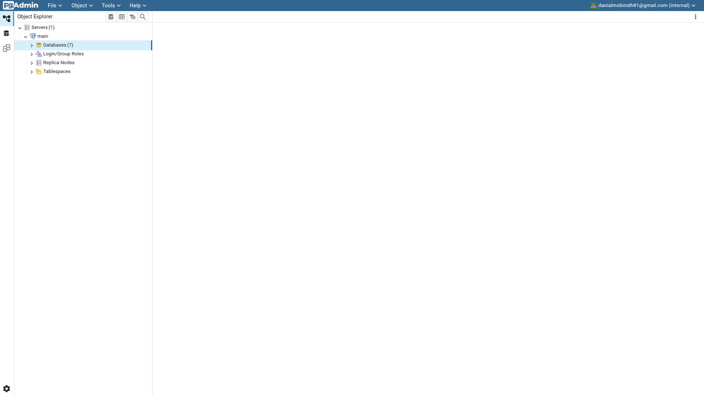
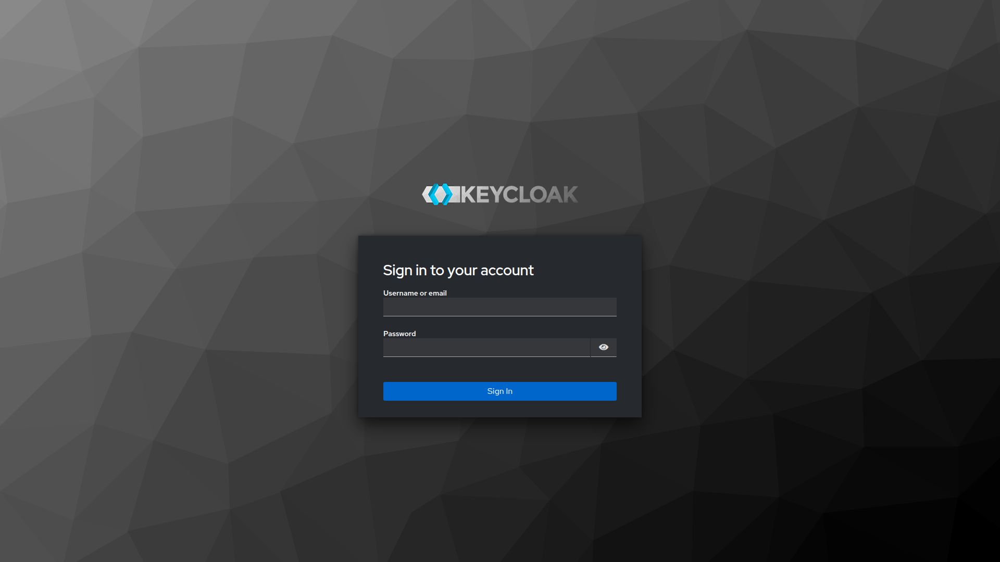
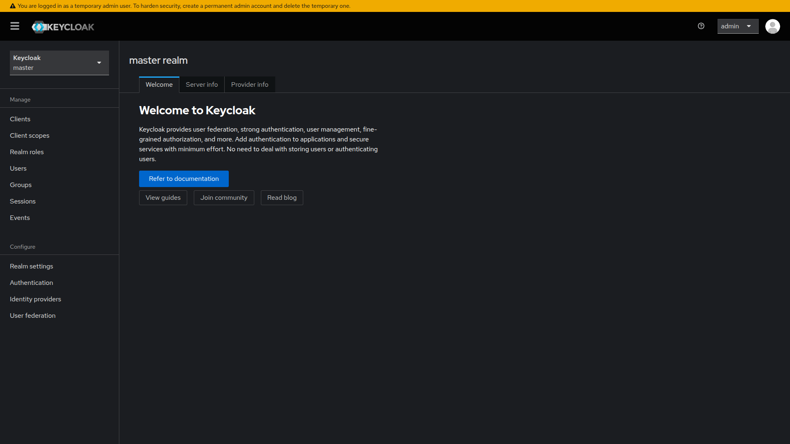
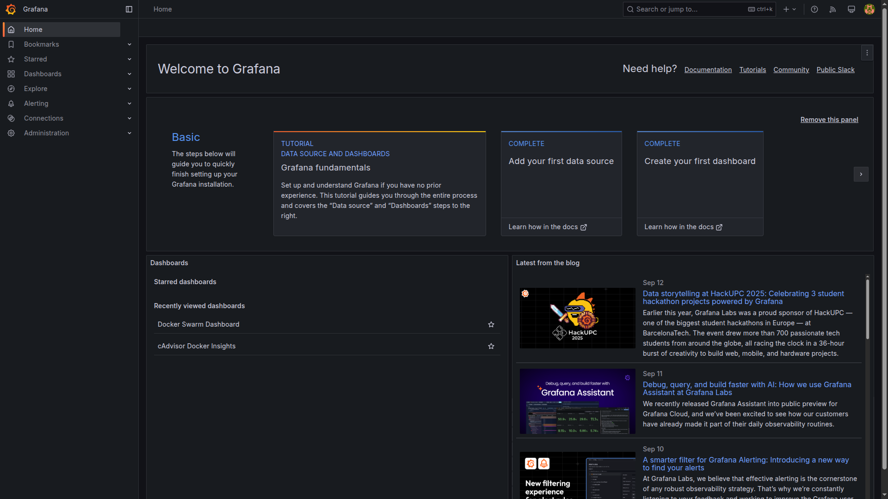
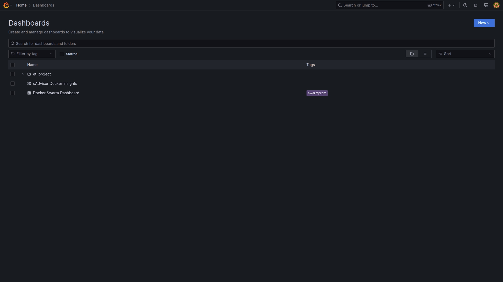
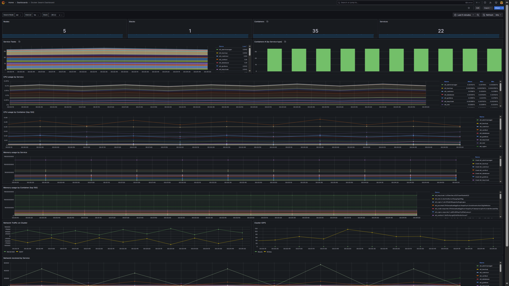
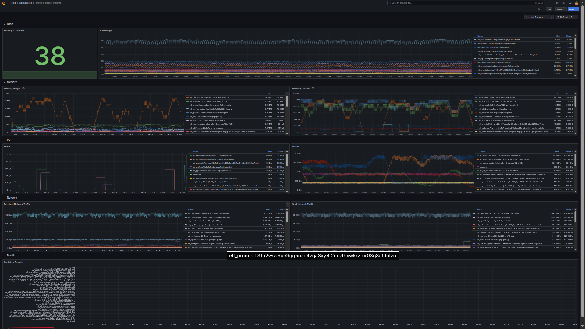
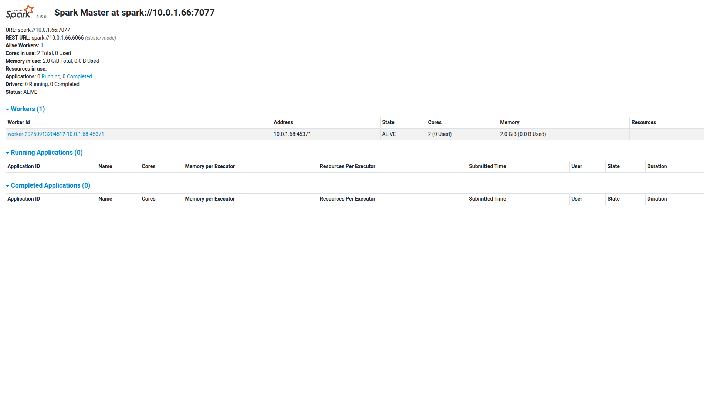
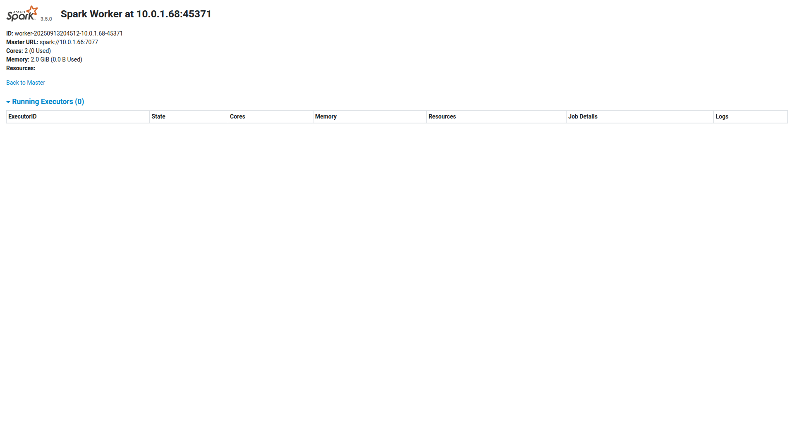
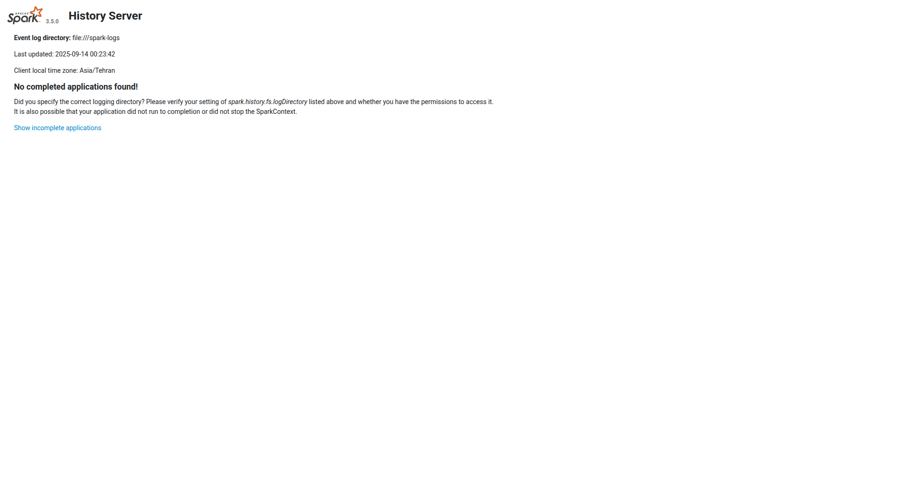

# ETL Project Implementation Guide - Phase by Phase

This project implements a robust, production-grade ETL pipeline on a Docker Swarm cluster, following modern DevOps and security best practices. The architecture includes PostgreSQL HA, Keycloak authentication, Apache Spark for data processing, and a full observability stack (Prometheus, Grafana, Loki, OpenTelemetry).

---

## Phase 1: Project Introduction & Setup

1. **Understand ETL Fundamentals**  
   - Review [docs/1. Introduction.md](docs/1.%20Introduction.md) for ETL concepts and hands-on exercises using Knime and COVID data.
2. **Provision Infrastructure**  
   - Deploy Swarm managers (public IP, SSH bastion) and workers (private IP). See [tasks/Project.md](tasks/Project.md) for node inventory and architecture diagrams.
   - Harden OS using Ansible and Lynis ([src/ansible/README.md](src/ansible/README.md)).
3. **DevOps Planning**  
   - Establish branching strategy (dev, test, main).
   - Prepare CI/CD pipeline templates ([tasks/Tasks.md](tasks/Tasks.md)).
   - Set up monitoring ([src/services/monitoring/README.md](src/services/monitoring/README.md)).

---

## Phase 2: Authentication

1. **Keycloak Deployment**  
   - Deploy Keycloak as a Docker service with HTTPS/SSL ([src/services/keycloak/README.md](src/services/keycloak/README.md)).
   - Configure realms, clients, and roles (System Administrator, Data Manager, Analyst).
   - Integrate Keycloak with PostgreSQL for user data ([docs/keycloak/test/README.md](docs/keycloak/test/README.md)).
   - Connect frontend/backend to Keycloak on the same Docker network.
2. **CI/CD & Environments**  
   - Implement CI/CD for automatic builds, tests, and Docker image publication ([tasks/Tasks.md](tasks/Tasks.md)).
   - Provide isolated dev, test, and prod environments.
   - Prepare Kubernetes manifests for future cloud-native deployments.

---

## Phase 3: Data Loading

1. **Database Infrastructure**  
   - Deploy PostgreSQL HA cluster (master/replica) with HAProxy ([src/services/database/](src/services/database/)).
   - Configure access control for team independence.
   - Automate backups and test restoration ([tasks/Project.md](tasks/Project.md)).
2. **Security & Validation**  
   - Enforce DoS protection, file size/upload limits, and data validation ([docs/3. Data Loading.md](docs/3.%20Data%20Loading.md)).
   - Monitor for unusual activity (Prometheus, Alertmanager).
3. **DevOps Support**  
   - Assist teams with DB operations, backup automation (`pg_dump`, `cron`), and monitoring setup ([src/services/monitoring/README.md](src/services/monitoring/README.md)).

---

## Phase 4: Data Operations

1. **Spark Deployment**  
   - Deploy Apache Spark cluster for distributed data processing ([src/services/spark/README.md](src/services/spark/README.md)).
   - Integrate with backend for dynamic SparkSQL generation.
   - Store Spark job history/logs on shared storage ([docs/volumes.md](docs/volumes.md)).
2. **Observability**  
   - Deploy OpenTelemetry Collector, Prometheus, Grafana, Loki, and Alertmanager ([src/services/monitoring/README.md](src/services/monitoring/README.md)).
   - Expose `/metrics` endpoints for all services.
   - Set up dashboards and alerts for Spark, DB, and Keycloak.
3. **Pipeline Support**  
   - Support teams in building scalable, plugin-based data pipelines.
   - Document best practices for filter/aggregation plugins.

---

## Overall DevOps Responsibilities

1. **Docker Swarm Infrastructure**  
   - Maintain 3 manager + 2 worker node cluster ([src/README.md](src/README.md)).
   - Ensure high availability, service placement, and overlay networking.
2. **CI/CD Pipeline Maintenance**  
   - Automate build, test, and deployment.
   - Enforce quality gates (security scans, automated tests).
   - Manage deployment promotion across environments.
3. **Observability Stack**  
   - Maintain OpenTelemetry, Prometheus, Grafana, Loki, and Jaeger.
   - Configure alerts, notifications, and support instrumentation.
4. **Security Implementation**  
   - Enforce HTTPS/SSL for all communications.
   - Support RBAC via Keycloak.
   - Harden SSH (bastion host), firewall, and database configs ([docs/ssh-bastion.md](docs/ssh-bastion.md)).
   - Validate and sanitize all uploaded data.
5. **Network & Storage**  
   - Ensure secure Docker Compose/Swarm network configuration.
   - Use NFS/shared storage for persistent data ([docs/shared-storage.md](docs/shared-storage.md), [docs/volumes.md](docs/volumes.md)).

---

## References

- [docs/README.md](docs/README.md): Full project guide and DevOps roadmap
- [diagrams/diagram.md](diagrams/diagram.md): Architecture diagrams
- [tasks/Project.md](tasks/Project.md), [tasks/Tasks.md](tasks/Tasks.md): Team roles and responsibilities
- [src/ansible/README.md](src/ansible/README.md): OS hardening

## 📸 Service Screenshots

### 🗄️ Database

| Screenshot | Description |
|------------|-------------|
|    | PgAdmin Dashboard |
|  | Database Details & Management |

[View Database](https://database.dani-docker.ir)

---

### 🛡️ Keycloak

| Screenshot | Description |
|------------|-------------|
|    | Keycloak Login Page |
|   | Keycloak Admin Console |

[View Keycloak](https://auth.dani-docker.ir)

---

### 📊 Grafana

| Screenshot | Description |
|------------|-------------|
|    | Main Grafana Dashboard |
|     | Metrics Visualization |
|      | Alerting Overview |
|     | Explore Data |
|    | Settings & Configuration |

[View Grafana](https://grafana.dani-docker.ir)

---

### 🧪 Spark

| Screenshot | Description |
|------------|-------------|
|    | Spark Master |
|  | Spark Worker |
|  | Spark History |
