# ETL Project Architecture Diagram

```mermaid
%%{init: {
  'theme': 'base',
  'themeVariables': { 
    'fontSize': '17px',
    'fontFamily': 'Trebuchet MS, Arial, sans-serif',
    'lineColor': '#000000',
    'primaryColor': '#000000',
    'primaryTextColor': '#000000',
    'primaryBorderColor': '#000000',
    'secondaryColor': '#000000', 
    'tertiaryColor': '#ffffff',
    'edgeLabelBackground': '#ffffff',
    'mainBkg': '#ffffff'
  },
  'flowchart': {
    'diagramPadding': 40,
    'nodeSpacing': 120,
    'rankSpacing': 120,
    'curve': 'basis'
  }
}}%%

graph TD
    %% Enhanced styling for links
    linkStyle default stroke-width:2.5px,stroke:#64748b,fill:none

    %% User Access Point
    User((User)):::user -->|"Access<br>Application"| Bastion

    %% Infrastructure Layer - Docker Swarm Cluster
    subgraph Infrastructure["🔌 Infrastructure Layer"]
        direction TB
        Bastion[Bastion Host<br>SSH Gateway]:::infrastructure

        subgraph SwarmManagers["Manager Nodes (HA)"]
            direction LR
            Manager1["Manager<br>Node 1<br>(Leader)"]:::infrastructure
            Manager2["Manager<br>Node 2<br>(Replica)"]:::infrastructure
            Manager1 <-->|"Raft<br>Consensus"| Manager2
        end

        subgraph SwarmWorkers["Worker Nodes"]
            direction LR
            Worker1["Worker<br>Node 1"]:::infrastructure
            Worker2["Worker<br>Node 2"]:::infrastructure
            Worker3["Worker<br>Node 3"]:::infrastructure
            Worker4["Worker<br>Node 4"]:::infrastructure
        end

        Bastion -->|"SSH"| Manager1
        Bastion -->|"SSH"| Manager2
        Bastion -->|"SSH"| Worker1
        Bastion -->|"SSH"| Worker2
        Bastion -->|"SSH"| Worker3
        Bastion -->|"SSH"| Worker4

        Manager1 -->|"Orchestrate"| Worker1
        Manager1 -->|"Orchestrate"| Worker2
        Manager1 -->|"Orchestrate"| Worker3
        Manager1 -->|"Orchestrate"| Worker4

        Manager2 -.->|"Failover<br>Orchestration"| Worker1
        Manager2 -.->|"Failover<br>Orchestration"| Worker2
        Manager2 -.->|"Failover<br>Orchestration"| Worker3
        Manager2 -.->|"Failover<br>Orchestration"| Worker4
    end

    %% Application Services Layer
    subgraph ApplicationServices["🖥️ Application Services Layer"]
        direction LR
        Frontend[Frontend<br>Container]:::app
        Backend[Backend<br>Container]:::app
        Nginx[Nginx<br>Reverse Proxy]:::infrastructure
        Keycloak[Keycloak<br>SSO]:::security
        Spark[Apache<br>Spark]:::app

        Nginx -->|"Proxy"| Frontend
        Nginx -->|"Proxy"| Keycloak
        Frontend -->|"Auth<br>Request"| Keycloak
        Frontend -->|"API<br>Requests"| Backend
        Backend -->|"Data<br>Processing"| Spark
    end

    %% ETL Pipeline Layer
    subgraph ETLPipeline["⚙️ ETL Pipeline Layer"]
        direction LR
        DataSource[(Data<br>Source)]:::storage -->|"Extract"| DataIngestion[Data<br>Ingestion]:::etl
        DataIngestion -->|"Validate"| DataValidation[Data<br>Validation]:::etl
        DataValidation -->|"Transform"| DataTransformation[Data<br>Transformation]:::etl
        DataTransformation -->|"Load"| DataLoad[Data<br>Loading]:::etl
        DataLoad -->|"Store"| PGMaster

        PipelineConfig[Pipeline<br>Configuration]:::etl
        PipelineConfig -->|"Configure"| DataIngestion
        PipelineConfig -->|"Configure"| DataValidation
        PipelineConfig -->|"Configure"| DataTransformation
        PipelineConfig -->|"Configure"| DataLoad

        DataTransformation -->|"Execute<br>Jobs"| Spark
    end

    %% High Availability and Backup Layer
    subgraph HALayer["🛡️ High Availability and Backup Layer (Parham)"]
        direction LR
        PGMaster[(PostgreSQL<br>Master)]:::storage
        PGReplica[(PostgreSQL<br>Replica)]:::storage
        BackupSystem[Automated<br>Backup]:::security
        BackupStorage[(Backup<br>Storage)]:::storage
        FailoverMechanism[Failover<br>Mechanism]:::security
        SelfRecovery[Node<br>Self-Recovery]:::security

        PGMaster <-->|"Replication"| PGReplica
        PGMaster -->|"Backup"| BackupSystem
        BackupSystem -->|"Store"| BackupStorage
        PGReplica -->|"Promote on<br>Master Failure"| FailoverMechanism
        FailoverMechanism -->|"Trigger"| PGMaster
        SelfRecovery -->|"Restore<br>Service"| Manager1
        SelfRecovery -->|"Restore<br>Service"| Manager2
    end

    %% Observability Layer
    subgraph ObservabilityLayer["📊 Observability Layer"]
        direction LR
        Prometheus[Prometheus]:::observability
        Grafana[Grafana<br>Dashboards]:::observability
        Loki[Loki<br>Log Aggregation]:::observability
        OpenTelemetry[OpenTelemetry<br>Collector]:::observability
        AlertManager[Alert<br>Manager]:::observability

        OpenTelemetry -->|"Metrics"| Prometheus
        OpenTelemetry -->|"Logs"| Loki
        Prometheus -->|"Data<br>Source"| Grafana
        Loki -->|"Data<br>Source"| Grafana
        Grafana -->|"Alerts"| AlertManager

        Frontend -.->|"Metrics<br>and Logs"| OpenTelemetry
        Backend -.->|"Metrics<br>and Logs"| OpenTelemetry
        PGMaster -.->|"Metrics<br>and Logs"| OpenTelemetry
        PGReplica -.->|"Metrics<br>and Logs"| OpenTelemetry
        Spark -.->|"Metrics<br>and Logs"| OpenTelemetry
        Keycloak -.->|"Metrics<br>and Logs"| OpenTelemetry

        subgraph Dashboards["Monitoring Dashboards"]
            direction LR
            InfraDash[Infrastructure<br>Dashboards]:::observability
            AppDash[Application<br>Dashboards]:::observability
            DBDash[Database<br>Dashboards]:::observability
            PipelineDash[ETL Pipeline<br>Dashboards]:::observability
            CIDash[CI/CD<br>Dashboards]:::observability
        end

        Grafana -->|"Display"| Dashboards
    end

    %% CI/CD Layer
    subgraph CICDLayer["🚀 CI/CD Layer"]
        direction LR
        GitHubActions[GitHub<br>Actions]:::cicd
        JenkinsCI[Jenkins<br>CI]:::cicd
        CIChoice{CI/CD<br>Choice}:::cicd
        BuildStage[Build<br>Stage]:::cicd
        TestStage[Test<br>Stage]:::cicd
        DeployStage[Deploy<br>Stage]:::cicd

        CIChoice -->|"Select"| GitHubActions
        CIChoice -->|"Select"| JenkinsCI
        GitHubActions -->|"Run"| BuildStage
        JenkinsCI -->|"Run"| BuildStage
        BuildStage -->|"Docker<br>Images"| TestStage
        TestStage -->|"Validated<br>Images"| DeployStage
        DeployStage -->|"Stack<br>Deploy"| Manager1
        DeployStage -.->|"Failover<br>Deploy"| Manager2
    end

    %% Database Connections - All through Parham's PostgreSQL
    Backend -->|"Data<br>Storage"| PGMaster
    Keycloak -->|"User<br>Storage"| PGMaster

    %% Team Responsibilities
    subgraph TeamResponsibilities["👥 Team Responsibilities"]
        direction LR
        Parham[Parham]:::user
        Danial[Danial]:::user
        Arman[Arman]:::user
        Radmehr[Radmehr]:::user

        Parham -->|"Responsible"| HALayer
        Parham -->|"Responsible"| SelfRecovery
        Danial -->|"Responsible"| Keycloak
        Danial -->|"Responsible"| Spark
        Arman -->|"Responsible"| ObservabilityLayer
        Radmehr -->|"Responsible"| CICDLayer
    end

    %% Infrastructure deployment with improved geometry
    Worker1 -.->|"Run"| Backend
    Worker1 -.->|"Run"| Frontend
    Worker2 -.->|"Run"| PGMaster
    Worker2 -.->|"Run"| PGReplica
    Worker2 -.->|"Run"| Keycloak
    Worker3 -.->|"Run"| Spark
    Worker3 -.->|"Run"| Nginx
    Worker4 -.->|"Run"| ObservabilityLayer

    %% Enhanced class definitions with more vibrant colors
    classDef infrastructure fill:#0891b2,stroke:#164e63,stroke-width:2px,color:white,rx:7
    classDef app fill:#0ea5e9,stroke:#0369a1,stroke-width:2px,color:white,rx:7
    classDef security fill:#e11d48,stroke:#9f1239,stroke-width:2px,color:white,rx:7
    classDef user fill:#f59e0b,stroke:#d97706,stroke-width:2px,color:white,rx:20,shape:circle
    classDef etl fill:#8b5cf6,stroke:#6d28d9,stroke-width:2px,color:white,rx:7
    classDef storage fill:#06b6d4,stroke:#0e7490,stroke-width:2px,color:white,shape:cylinder,rx:7
    classDef observability fill:#f43f5e,stroke:#be123c,stroke-width:2px,color:white,rx:7
    classDef cicd fill:#7c3aed,stroke:#5b21b6,stroke-width:2px,color:white,rx:7

    %% Keycloak Realm and Clients
    subgraph KeycloakRealm["Keycloak Realm: etl-project"]
        direction TB
        KCRealm[Realm: etl-project]:::security
        KCClientFrontend[Client: etl-frontend<br>Type: Public]:::security
        KCClientBackend[Client: etl-backend<br>Type: Confidential]:::security
        KCClientSpark[Client: etl-spark<br>Type: Confidential]:::security
        KCClientGrafana[Client: etl-grafana<br>Type: Public]:::security

        KCRealm --> KCClientFrontend
        KCRealm --> KCClientBackend
        KCRealm --> KCClientSpark
        KCRealm --> KCClientGrafana
    end

    %% User Interaction Flow
    User -.->|"Login<br>OIDC"| KCClientFrontend
    User -.->|"SSO<br>OIDC"| KCClientGrafana

    %% Service Authentication Flow
    Frontend -.->|"OIDC Auth<br>via etl-frontend client"| KCClientFrontend
    Backend -.->|"OIDC Auth<br>via etl-backend client"| KCClientBackend
    Spark -.->|"OIDC Auth<br>via etl-spark client"| KCClientSpark
    Grafana -.->|"OIDC Auth<br>via etl-grafana client"| KCClientGrafana

    %% Keycloak Authentication Flow (Angular + .NET)
    %% This section visually explains the user and service authentication steps in your ETL project

    %% User Login Flow
    User -.->|"Clicks Login<br>in Angular Frontend"| Frontend
    Frontend -.->|"Redirects to<br>Keycloak Login Page"| Keycloak
    Keycloak -.->|"User Authenticates<br>(Username/Password or Social Login)"| Keycloak
    Keycloak -.->|"Issues Tokens<br>(Auth Code → JWT and Refresh Token)"| Frontend
    Frontend -.->|"Sends Access Token<br>in API Request"| Backend
    Backend -.->|"Validates JWT<br>using Keycloak Public Key"| Keycloak
    Backend -.->|"Checks Roles/Permissions<br>in JWT"| Keycloak
    Backend -.->|"Returns Data<br>to Angular Frontend"| Frontend

    %% Service-to-Service Auth Flow
    Spark -.->|"Uses OIDC Token<br>via etl-spark client"| KCClientSpark
    Grafana -.->|"Uses OIDC Token<br>via etl-grafana client"| KCClientGrafana

    %% Client Types
    KCClientFrontend[Client: etl-frontend<br>Type: Public]:::security
    KCClientBackend[Client: etl-backend<br>Type: Confidential]:::security
    KCClientSpark[Client: etl-spark<br>Type: Confidential]:::security
    KCClientGrafana[Client: etl-grafana<br>Type: Public]:::security

    %% Realm
    KCRealm[Realm: etl-project]:::security
    KCRealm --> KCClientFrontend
    KCRealm --> KCClientBackend
    KCRealm --> KCClientSpark
    KCRealm --> KCClientGrafana

    %% User Interaction
    User -.->|"Login/SSO<br>OIDC"| KCClientFrontend
    User -.->|"SSO<br>OIDC"| KCClientGrafana

    %% Service Authentication
    Frontend -.->|"OIDC Auth<br>via etl-frontend client"| KCClientFrontend
    Backend -.->|"OIDC Auth<br>via etl-backend client"| KCClientBackend
    Spark -.->|"OIDC Auth<br>via etl-spark client"| KCClientSpark
    Grafana -.->|"OIDC Auth<br>via etl-grafana client"| KCClientGrafana

    %% Additional details from Project.md

    %% Data Validation and Data Ingestion explicitly shown in ETL Pipeline Layer
    DataSource[(Data<br>Source)]:::storage -->|"Extract"| DataIngestion[Data<br>Ingestion]:::etl
    DataIngestion -->|"Validate"| DataValidation[Data<br>Validation]:::etl
    DataValidation -->|"Transform"| DataTransformation[Data<br>Transformation]:::etl
    DataTransformation -->|"Load"| DataLoad[Data<br>Loading]:::etl
    DataLoad -->|"Store"| PGMaster

    %% Pipeline Configuration node for managing ETL job parameters
    PipelineConfig[Pipeline<br>Configuration]:::etl
    PipelineConfig -->|"Configure"| DataIngestion
    PipelineConfig -->|"Configure"| DataValidation
    PipelineConfig -->|"Configure"| DataTransformation
    PipelineConfig -->|"Configure"| DataLoad

    %% Explicit role-based access control for data operations
    subgraph RBAC["Role-Based Access Control"]
        direction TB
        SysAdmin["System Administrator"]:::security
        DataManager["Data Manager"]:::security
        Analyst["Analyst"]:::security
        SysAdmin -->|"Creates Users<br>and Sets Roles"| Keycloak
        DataManager -->|"Manages Data<br>and Pipelines"| Backend
        Analyst -->|"Views Data<br>and Results"| Frontend
    end

    %% Password management and dynamic role assignment
    User -.->|"Change Password<br>and Profile"| Keycloak
    SysAdmin -.->|"Change User Roles<br>Anytime"| Keycloak

    %% Automatic backups and restore procedures for production data
    PGMaster -->|"Automatic<br>Backup"| BackupSystem
    BackupSystem -->|"Restore<br>Procedures"| PGMaster

    %% File size and upload limits enforced in data ingestion
    DataIngestion -.->|"Enforce File Size<br>and Upload Limits"| Backend

    %% Data validation and sanitization for security
    DataIngestion -.->|"Validate & Sanitize<br>Uploaded Data"| DataValidation

    %% All database operations centralized under Parham's responsibility
    Parham -.->|"Manages<br>All DB Operations"| PGMaster

    %% Note: These additions reflect the explicit RBAC, data validation, backup, and operational details
```

## Docker Swarm ETL Architecture Explanation

This architecture diagram represents our ETL (Extract, Transform, Load) pipeline project built on Docker Swarm. The design incorporates all the components and responsibilities described in both the Project.md and Tasks.md files, organized into logical layers.

### Infrastructure Layer

The foundation of our architecture is a **Docker Swarm cluster** consisting of:

- **Bastion Host**: Acts as a secure SSH gateway, providing controlled access to all nodes in the cluster
- **Manager Nodes (2)**: Run in high availability (HA) mode using Raft consensus to maintain cluster state
- **Worker Nodes (4)**: Execute the containerized workloads distributed by the manager nodes

This infrastructure follows security best practices with:

- Public IPs only for manager nodes
- Private IPs for worker nodes
- SSH access through the bastion host
- Ansible automation for configuration management

### Application Services Layer

The core application components include:

- **Frontend**: User interface container
- **Backend**: Application logic container
- **Nginx**: Reverse proxy for routing and security
- **Keycloak**: Single sign-on (SSO) authentication service
- **Apache Spark**: Distributed data processing engine

### ETL Pipeline Layer

The data processing workflow consists of:

1. **Data Ingestion**: Extracting data from sources
2. **Data Validation**: Ensuring data quality and integrity
3. **Data Transformation**: Processing using Apache Spark
4. **Data Loading**: Storing results in PostgreSQL
5. **Pipeline Configuration**: Managing ETL job parameters

### High Availability & Database Layer (Parham's Responsibility)

All database operations are now centralized through Parham's PostgreSQL implementation:

- **PostgreSQL Master-Replica**: High availability database setup
- **Automated Backup System**: Regular database backups
- **Failover Mechanism**: Automatic recovery on master failure
- **Database Clients**:
  - Keycloak for user authentication data
  - Backend application for business data
  - ETL pipeline for processed data

### Observability Layer

Comprehensive monitoring is provided by:

- **OpenTelemetry**: Collection of metrics, logs, and traces
- **Prometheus**: Time-series database for metrics
- **Grafana**: Visualization dashboards
- **Loki**: Log aggregation system
- **Alert Manager**: Notification system for issues

Custom dashboards are created for infrastructure, applications, databases, ETL pipelines, and CI/CD processes.

### CI/CD Layer

Automated deployment pipeline with:

- **CI/CD Choice**: Selection between GitHub Actions or Jenkins CI
- **Build Stage**: Creating Docker images
- **Test Stage**: Validating functionality
- **Deploy Stage**: Rolling out to Docker Swarm using stack deploy

### Team Responsibilities

Tasks are distributed among team members:

- **Parham**: Database backup, failover, self-recovery, PostgreSQL optimization
- **Danial**: Keycloak authentication, Apache Spark setup
- **Arman**: Monitoring stack, metrics collection, observability best practices
- **Radmehr**: CI/CD implementation, pipeline visualization

## Implementation Notes

This architecture emphasizes:

1. **Simplicity**: Docker Swarm provides easier management compared to Kubernetes
2. **Security**: Bastion host, private networks, and role-based access control
3. **High Availability**: Redundancy at infrastructure and data layers
4. **Observability**: Comprehensive monitoring and alerting
5. **Automation**: CI/CD pipeline and infrastructure as code
6. **Resilience**: Self-healing mechanisms for both nodes and services
7. **Centralized Database Management**: All database operations are now consolidated under Parham's responsibility for better coordination and reliability

For deployment, Docker Compose files will be used with `docker stack deploy` commands through the CI/CD pipeline, targeting the manager nodes for orchestration across the entire cluster.
