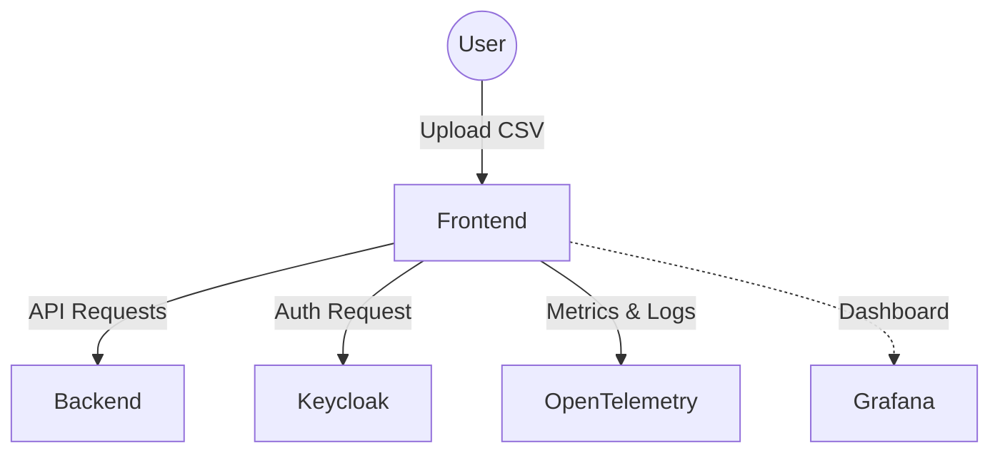
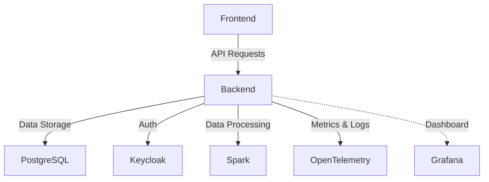
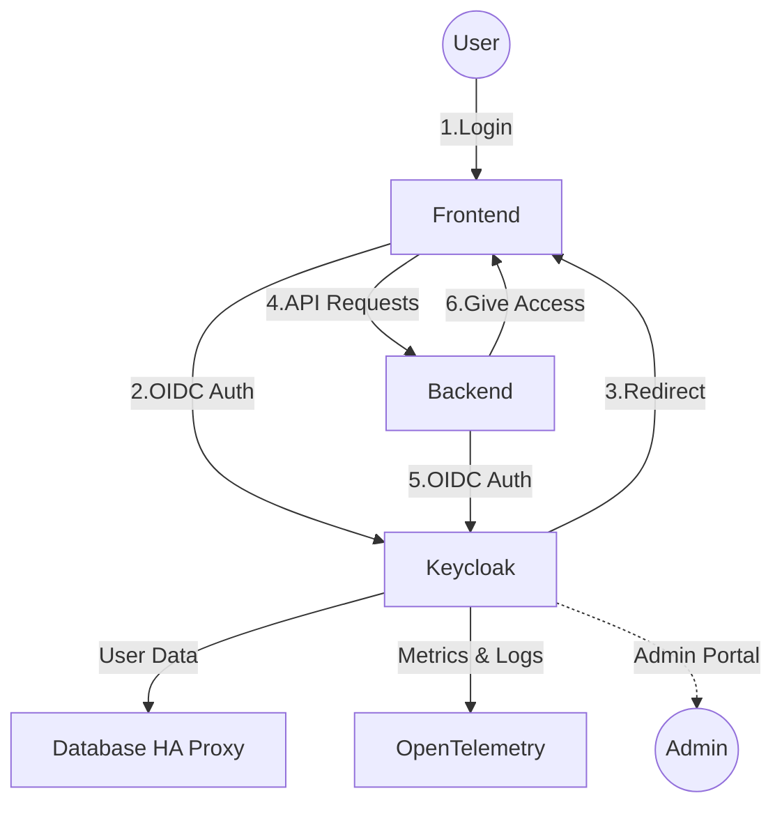
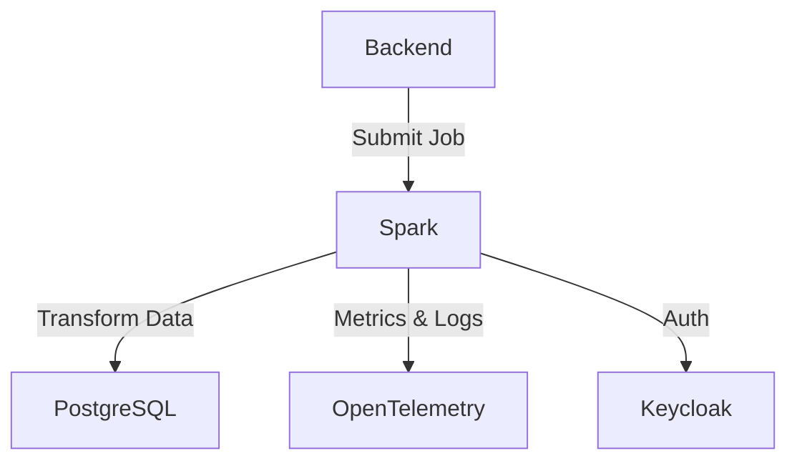
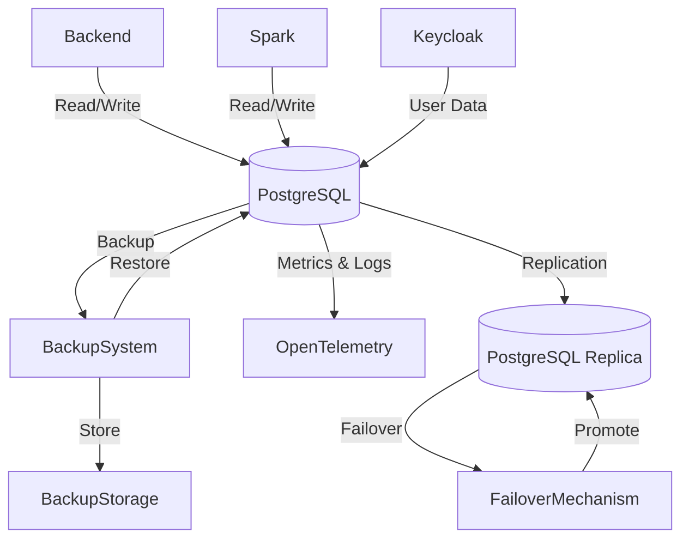
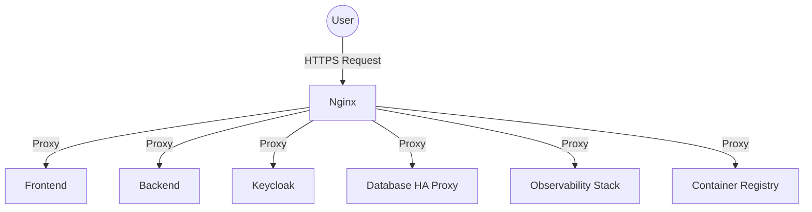
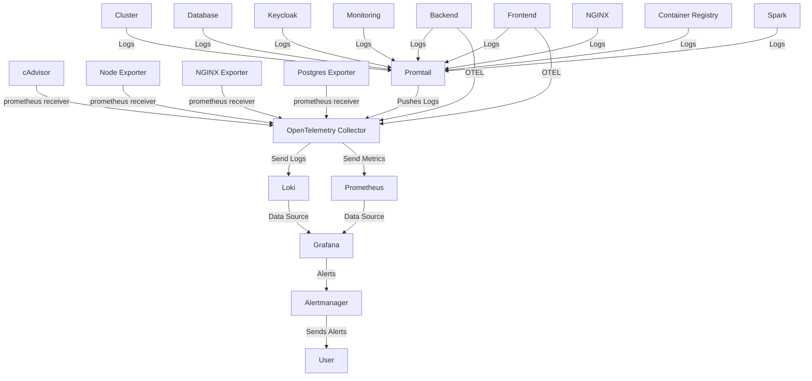
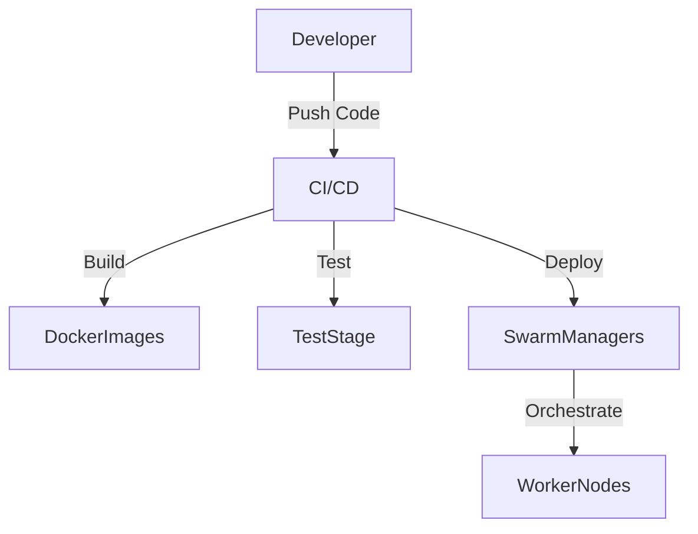

## 1. **Frontend Service Diagram**

**Explanation:**  

- The Frontend is the user-facing web UI.
- Users upload data and interact with the ETL pipeline.
- Authenticates via Keycloak (SSO).
- Sends API requests to the Backend.
- Exposes metrics and logs to the observability stack (OpenTelemetry Collector, Prometheus, Loki, Grafana).

---

## 2. **Backend Service Diagram**

**Explanation:**  

- The Backend handles business logic, data validation, and transformation orchestration.
- Stores and retrieves data from PostgreSQL.
- Authenticates users via Keycloak.
- Orchestrates Spark jobs for data transformation.
- Sends metrics and logs to the observability stack for monitoring and alerting.

---

## 3. **Keycloak Service Diagram**

**Explanation:**  

- Keycloak provides authentication and authorization.
- Stores user data in PostgreSQL.
- Integrates with the observability stack for monitoring (metrics/logs sent to OpenTelemetry Collector, Prometheus, Loki).
- Provides an admin portal for user management.

---

## 4. **Spark Service Diagram**

**Explanation:**  

- Spark executes distributed data transformations.
- Receives jobs from the Backend.
- Reads/writes data to PostgreSQL.
- Authenticates via Keycloak.
- Sends metrics and logs to the observability stack for performance and health monitoring.

---

## 5. **Database Service Diagram**

**Explanation:**  

- The **Database** service (PostgreSQL) is the central data store for all services.
- Backend, Spark, and Keycloak interact with the database for data storage and retrieval.
- Automatic backup and restore procedures are managed by the BackupSystem, which stores backups in BackupStorage.
- The database is replicated for high availability using PGReplica, with failover managed by a FailoverMechanism.
- All database operations, backup, and HA events are monitored via the observability stack (metrics/logs sent to OpenTelemetry Collector, Prometheus, Loki).

---

## 6. **Nginx Service Diagram**

**Explanation:**  

- Nginx acts as a reverse proxy, routing external traffic to internal services.
- Terminates SSL and enforces security policies.

---

## 7. **Observability Stack Diagram**

**Explanation:**  

- **OpenTelemetry Collector** gathers metrics and logs from all services.
- **Node Exporter** collects host-level metrics (CPU, memory, disk, etc.).
- **cAdvisor** collects container-level metrics (resource usage, performance).
- **Prometheus** stores metrics from OpenTelemetry, Node Exporter, and cAdvisor.
- **Loki** stores logs from OpenTelemetry and Promtail.
- **Promtail** ships logs from host files to Loki.
- **Grafana** visualizes metrics and logs from Prometheus and Loki, and sends alerts.
- **Alertmanager** handles alerts triggered by Grafana or Prometheus.

---

## 8. **CI/CD Pipeline Diagram**

**Explanation:**  

- Developers push code to CI/CD (GitHub Actions/Jenkins).
- Pipeline builds, tests, and deploys Docker images to Swarm managers.
- Managers orchestrate deployment across worker nodes.
- CI/CD pipeline events and deployment health can be monitored via the observability stack.

---

## **Summary Table: Service Interactions**

| Service              | Depends On                        | Exposes To                  | Observability Stack                        |
|----------------------|-----------------------------------|-----------------------------|--------------------------------------------|
| Frontend             | Backend, Keycloak                 | User                        | OpenTelemetry, Prometheus, Loki, Grafana   |
| Backend              | PostgreSQL, Spark, Keycloak       | Frontend                    | OpenTelemetry, Prometheus, Loki, Grafana   |
| Keycloak             | PostgreSQL                        | All Services                | OpenTelemetry, Prometheus, Loki, Grafana   |
| Spark                | PostgreSQL, Keycloak              | Backend                     | OpenTelemetry, Prometheus, Loki, Grafana   |
| PostgreSQL + Backup/HA | PGReplica, BackupSystem         | Backend, Spark, Keycloak, Admins/DevOps | OpenTelemetry, Prometheus, Loki, Grafana   |
| Nginx                | All Services                      | User                        | OpenTelemetry, Prometheus, Loki, Grafana   |
| Observability Stack  | All Services                      | Admins/DevOps               | -                                          |
| CI/CD                | SwarmManagers                     | Developer                   | OpenTelemetry, Prometheus, Loki, Grafana   |

---

### **Best Practices & Tips**

- Keep each service on its own overlay network for isolation.
- Use internal service names for inter-service communication.
- Only expose Nginx to the public; keep other services internal.
- Monitor all services for health, performance, and logs using the observability stack (OpenTelemetry Collector, Prometheus, Loki, Grafana, Alertmanager).
- Automate backups and test restore procedures regularly.
- Ensure alerting is configured for critical metrics and logs.

---

### **Follow-Up Learning Resources**

- [Docker Compose Networking](https://docs.docker.com/compose/networking/)
- [Keycloak Integration Patterns](https://www.keycloak.org/docs/latest/server_admin/#_integration)
- [Spark on Docker](https://spark.apache.org/docs/latest/running-on-docker.html)
- [Prometheus & Grafana Monitoring](https://prometheus.io/docs/introduction/overview/)
- [Loki Log Aggregation](https://grafana.com/docs/loki/latest/)
- [OpenTelemetry Documentation](https://opentelemetry.io/docs/)
