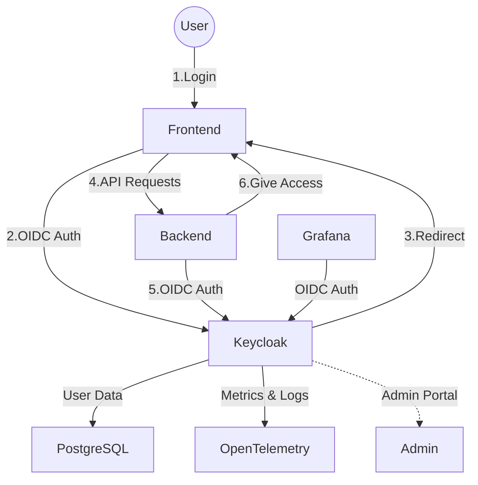
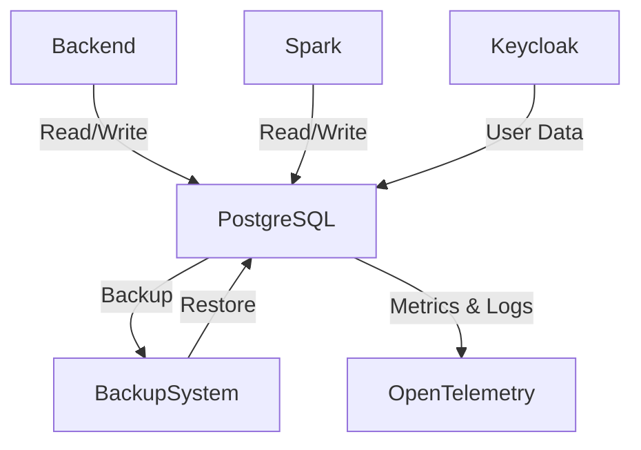
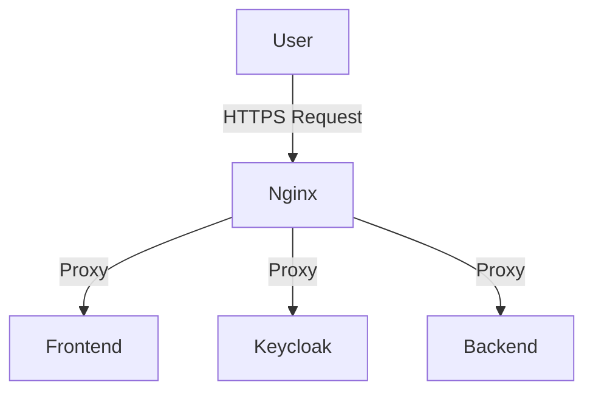
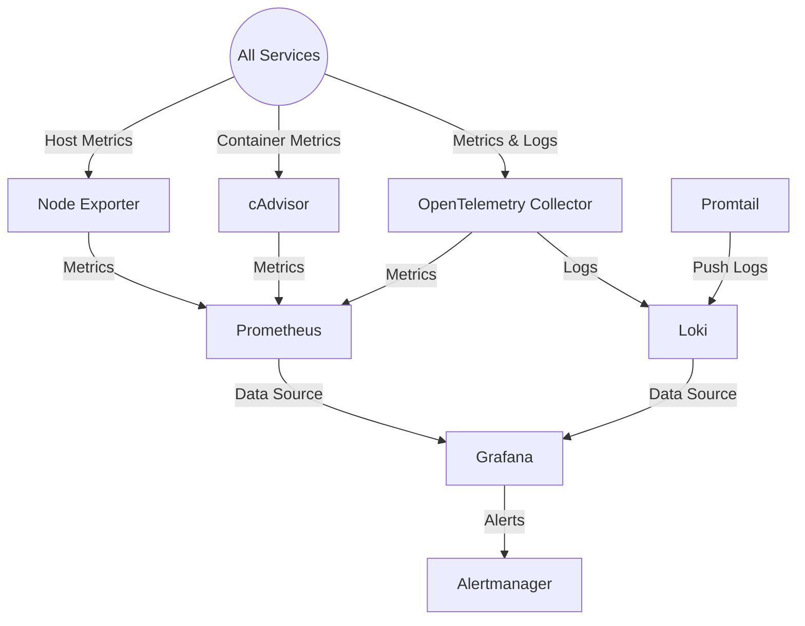
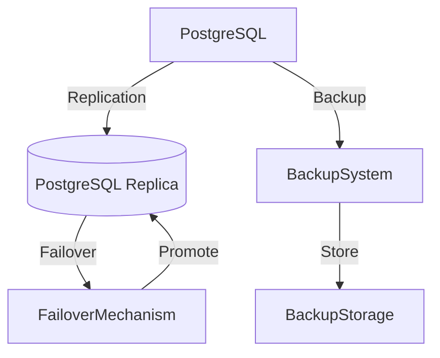

## 1. **Frontend Service Diagram**

**Explanation:**  

- The Frontend is the user-facing web UI.
- Users upload data and interact with the ETL pipeline.
- Authenticates via Keycloak (SSO).
- Sends API requests to the Backend.
- Exposes metrics/logs to OpenTelemetry and Grafana.

---

## 2. **Backend Service Diagram**

**Explanation:**  

- The Backend handles business logic, data validation, and transformation orchestration.
- Stores and retrieves data from PostgreSQL.
- Authenticates users via Keycloak.
- Orchestrates Spark jobs for data transformation.
- Sends metrics/logs to OpenTelemetry and Grafana.

---

## 3. **Keycloak Service Diagram**

**Explanation:**  

- Keycloak provides authentication.
- Stores user data in PostgreSQL.
- Integrates with OpenTelemetry for monitoring.
- Provides an admin portal for user management.

---

## 4. **Spark Service Diagram**

**Explanation:**  

- Spark executes distributed data transformations.
- Receives jobs from the Backend.
- Reads/writes data to PostgreSQL.
- Authenticates via Keycloak.
- Sends metrics/logs to OpenTelemetry.

---

## 5. **PostgreSQL Service Diagram**

**Explanation:**  

- Central data store for all services.
- Automatic backup and restore procedures.
- Monitored via OpenTelemetry.

---

## 6. **Nginx Service Diagram**

**Explanation:**  

- Nginx acts as a reverse proxy, routing external traffic to internal services.
- Terminates SSL and enforces security policies.

---

## 7. **Observability Stack Diagram**

**Explanation:**  

- **OpenTelemetry Collector** gathers metrics and logs from all services.
- **Node Exporter** collects host-level metrics (CPU, memory, disk, etc.).
- **cAdvisor** collects container-level metrics (resource usage, performance).
- **Prometheus** stores metrics from OpenTelemetry, Node Exporter, and cAdvisor.
- **Loki** stores logs from OpenTelemetry and Promtail.
- **Promtail** ships logs from host files to Loki.
- **Grafana** visualizes metrics and logs from Prometheus and Loki, and sends alerts.
- **Alertmanager** handles alerts triggered by Grafana or Prometheus.

---

## 8. **Backup & HA Diagram**

**Explanation:**  

- PostgreSQL is replicated for high availability.
- Automated backups and failover mechanisms ensure resilience.

---

## 9. **CI/CD Pipeline Diagram**

**Explanation:**  

- Developers push code to CI/CD (GitHub Actions/Jenkins).
- Pipeline builds, tests, and deploys Docker images to Swarm managers.
- Managers orchestrate deployment across worker nodes.

---

## **Summary Table: Service Interactions**

| Service     | Depends On         | Exposes To         | Observability      |
|-------------|--------------------|--------------------|--------------------|
| Frontend    | Backend, Keycloak  | User               | OpenTelemetry, Grafana |
| Backend     | PostgreSQL, Spark, Keycloak | Frontend      | OpenTelemetry, Grafana |
| Keycloak    | PostgreSQL         | All Services       | OpenTelemetry      |
| Spark       | PostgreSQL, Keycloak | Backend           | OpenTelemetry      |
| PostgreSQL  | BackupSystem, PGReplica | Backend, Spark, Keycloak | OpenTelemetry      |
| Nginx       | All Services       | User               | -                  |
| Observability Stack | All Services | Admins/DevOps      | -                  |
| Backup/HA   | PostgreSQL         | Admins/DevOps      | -                  |
| CI/CD       | SwarmManagers      | Developer          | -                  |

---

### **Best Practices & Tips**

- Keep each service on its own overlay network for isolation.
- Use internal service names for inter-service communication.
- Only expose Nginx to the public; keep other services internal.
- Monitor all services for health and performance.
- Automate backups and test restore procedures regularly.

---

### **Follow-Up Learning Resources**

- [Docker Compose Networking](https://docs.docker.com/compose/networking/)
- [Keycloak Integration Patterns](https://www.keycloak.org/docs/latest/server_admin/#_integration)
- [Spark on Docker](https://spark.apache.org/docs/latest/running-on-docker.html)
- [Prometheus & Grafana Monitoring](https://prometheus.io/docs/introduction/overview/)
- [CI/CD Best Practices](https://martinfowler.com/articles/continuousIntegration.html)
