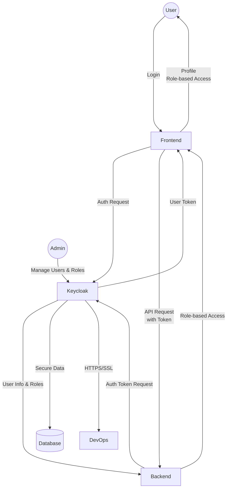

# Authentication

## Introduction

One of the most important requirements for any software application is the ability to authenticate users and control access. This is especially critical for applications that handle sensitive or collected data, as unauthorized access can lead to misuse or malicious activities.

## Application

The first requirement of this project is to implement user management features, including account creation, authentication, and access control.

User data must be stored securely, and identities should be verified during login. Additionally, users should have different access levels so that, as the system grows, their permissions for each module can be managed.

For now, three access levels are proposed: System Administrator, Data Manager, and Analyst. Users should be created by the System Administrator, and their access level should be set at creation. These access levels must be dynamic and changeable at any time. Each user should also be able to change their own password.

Instead of building these features from scratch, we will use an open-source solution: [Keycloak](https://www.keycloak.org/). Keycloak will handle authentication and access control for the project.

### Output

The output of this stage will be two containers (one for the backend and one for the frontend).

After deployment, users visiting the website will see a welcome page with a login option. Clicking login will redirect them to the Keycloak authentication page. Upon successful authentication, users will be logged into the website.

Once logged in, the username will be displayed in the top menu, and users will have access to their profile page. Depending on their role, users will be able to add new users and change their password from the profile page.

## Platform

The goal of this stage is to provide development, test, and production environments using tools like Docker, Kubernetes, and CI/CD pipelines. Additionally, by collaborating on system architecture and advising developers, we ensure the software is built according to Cloud Native standards.

A Keycloak instance should be deployed as a Docker container, following strict security standards (including HTTPS/SSL support). Connection details must be shared with development teams.

### Output

In this section, CI/CD pipelines should be designed and implemented in collaboration with development teams to automatically build and test code, then publish Docker images to a registry.

Kubernetes manifests should be created for deploying each team's images.

A Keycloak instance should also be deployed and configured so that development teams can use it in the test environment without affecting production or other teams.

## Sequence Diagram

**Legend:**

- Users interact with the frontend, which delegates authentication to Keycloak.
- Keycloak manages user data, roles, and secure access.
- Admins manage users and roles via Keycloak.
- Both frontend and backend containers use Keycloak for authentication and authorization.
- DevOps ensures Keycloak is securely deployed (HTTPS/SSL).
