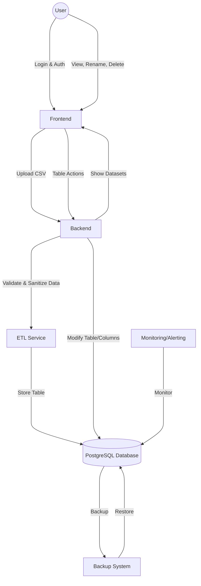

# Data Loading

## Introduction

In this stage, you will implement the **Load** part of the ETL (Extract, Transform, Load) process. The goal is to import data into the system in a standardized format and store it in a structured way using a data management system, so it can be used for future operations.

### What is ETL?

**ETL** stands for **Extract, Transform, Load**. It is a common process in data engineering and analytics for moving and preparing data from various sources into a target system (like a database or data warehouse).  

- **Extract:** Get data from source systems.  
- **Transform:** Clean and format the data.  
- **Load:** Store the data in the target system.

## Application

Development teams should design a page where users with the "System Administrator" or "Data Manager" roles can upload their datasets. The datasets must be provided as **CSV files** (Comma-Separated Values), which are a standard format for tabular data.

Once uploaded, the data should be stored as a table in the database. The following features should be available for these tables:

- View data
- Delete tables
- Rename tables
- Delete columns in any table
- Rename columns in any table

At this stage, all uploaded data is accessible to all users, and each user can modify tables according to their role.

### Output

After implementing this stage, when a user logs into the website:

1. They see a list of uploaded datasets.
2. Depending on their role, they can interact with the data (using the features listed above).

## Platform

For this phase, development teams will need a **database** to store and manage their data. Since uploading data can introduce security risks, especially if not handled properly, it is important to prevent vulnerabilities such as **Denial of Service (DoS) attacks**.

### What is a Database?

A **database** is a system for storing, organizing, and managing data. In most web applications, a database is used to persist user data, application state, and more.  
**PostgreSQL** is a popular open-source relational database system, known for reliability, scalability, and advanced features.

### What is a DoS Attack?

A **Denial of Service (DoS) attack** is when an attacker tries to make a system unavailable to its users, usually by overwhelming it with requests or data. Preventing DoS attacks is critical for maintaining system reliability.

### Output

1. **Database Infrastructure:**
   - Provide PostgreSQL instances for development teams.
   - Configure access so teams can work independently without affecting other teams or the production environment.

2. **Production Data Support:**
   - Implement automatic backups for production data.
   - Ensure data can be restored in case of failure.

3. **Security and Hardening:**
   - Work with development teams to prevent vulnerabilities that could lead to DoS attacks.
   - Test each product’s resilience by simulating DoS attacks.

---

**Best Practices:**

- Always validate and sanitize uploaded data.
- Limit file size and number of uploads to prevent abuse.
- Use role-based access control for database operations.
- Regularly back up your database and test recovery procedures.
- Monitor system performance and set alerts for unusual activity.

**Common Pitfalls:**

- Not restricting upload permissions or file sizes.
- Failing to back up data or test restores.
- Overlooking security checks on uploaded files.
- Not isolating development and production environments.

**Practical Tips:**

- Use PostgreSQL’s built-in roles and permissions for access control.
- Automate backups using tools like `pg_dump` and schedule them with `cron`.
- Use monitoring tools (like Prometheus or Grafana) to watch for performance issues.
- Test your system with simulated large uploads to ensure it can handle

## Sequence Diagram

**Legend:**

- Users upload CSV files via the frontend.
- Backend validates, sanitizes, and passes data to the ETL service.
- ETL stores the data in PostgreSQL.
- Users can view and manage tables based on their roles.
- Database is backed up and monitored for reliability and security.
