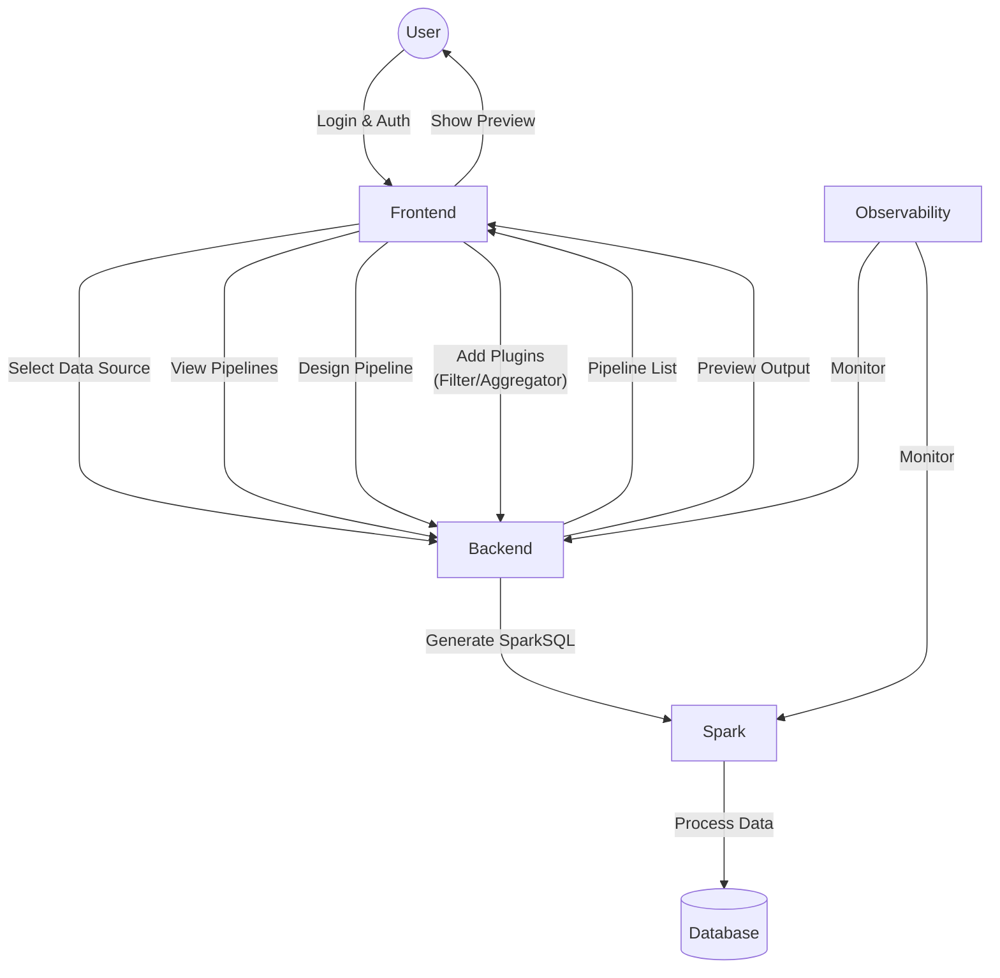

# Data Operations

## Introduction

In this stage, you will implement the **Transform** part of the ETL (Extract, Transform, Load) process. The goal is to allow users to design pipelines for processing their uploaded data, apply various operations, and view the output at each step.

## Application

Development teams should create pages that let users design data pipelines and view a list of previously created pipelines. On the pipeline design page:

- Users can use **filter** and **aggregation** plugins.
- Operations can be arranged in any order and quantity.
- Operations are executed on a specific, pre-loaded data source.
- Clicking on any plugin shows a **preview** of the output data.

**For data processing:**

- Instead of running queries directly on the database, use open-source data processors like [Apache Spark](https://spark.apache.org/).
- Generate **SparkSQL** code dynamically for each pipeline.

### Output

#### Pipeline List Page

- Users can access the list of pipelines after the data page.
- Management features:
  - View designed pipelines
  - Rename pipelines
  - Delete pipelines
  - Edit existing pipelines
  - Design new pipelines

#### Pipeline Design Page

##### a) Workflow

1. Select a data source.
2. Add plugins in the desired order.

##### b) Plugin Behavior

- **Filters:** Can be changed without affecting the data structure.
- **Aggregators:** Change the data structure (rename/type change columns).
  - Changed columns: removed from subsequent steps.
  - Unchanged columns: retained in subsequent steps.

##### c) Preview System

- Clicking a plugin:
  - Shows the plugin settings menu.
  - Displays the output of that plugin in the preview.
- Closing the menu:
  - Hides the settings menu.
  - Shows the output of the last plugin in the preview.

## Platform

At this stage, teams need access to **Spark** and observability infrastructure so the status of each product can be monitored in production.

### Output

1. **Spark Deployment:**
   - Deploy Spark according to security standards.
   - Make Spark available to development teams.

2. **Observability Implementation:**
   - Deploy observability infrastructure based on the **OpenTelemetry** standard.
   - Integrate observability with products in coordination with development

## Sequence Diagram

**Legend:**

- Users design and manage pipelines via the frontend.
- Backend generates SparkSQL and interacts with Spark for data processing.
- Spark processes data from the database.
- Preview system lets users see output at each pipeline step.
- Observability monitors Spark and backend for reliability.
