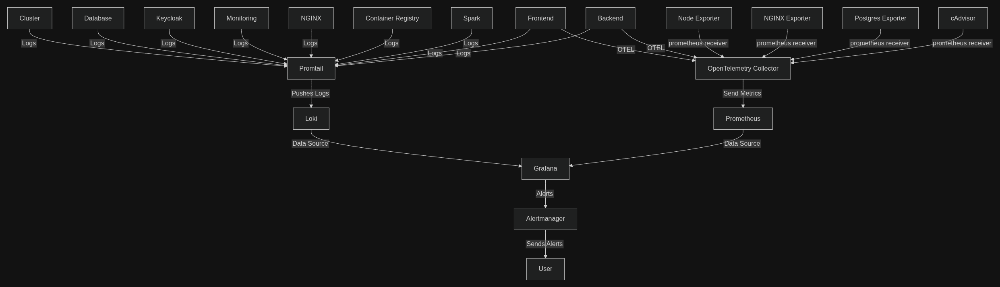

# Service Access Reference for Developer Teams

## 1. Database (PostgreSQL with HAProxy)

- **Nginx Address:**  
  `https://database.dani-docker.ir/`

  ### Accessing PostgreSQL via pgAdmin

  To connect to the PostgreSQL database using pgAdmin:

  1. **Log in to pgAdmin** with your team credentials:

  - **Team1:**  
  - Username: `team1@pgadmin.com`  
  - Password: `changemeteam1`
  - **Team2:**  
  - Username: `team2@pgadmin.com`  
  - Password: `changemeteam2`
  - **Team3:**  
  - Username: `team3@pgadmin.com`  
  - Password: `changemeteam3`

  2. **Register a new server:**
  - Right-click **Servers** → **Register** → **Server...**
  - **Name:** (e.g.) `Team1 Database`

  3. **Configure the connection:**
  - **Host:** `database`
  - **Port:** `5432`
  - **Username:** your team username (e.g., `team1@pgadmin.com`)
  - **Password:** your team password
  - **SSL:** Enable if required (recommended for production)

  4. **Save and connect.**  
   You will have access only to your team’s database.

---

## 2. Keycloak (Authentication Provider)

- **Nginx Address:**  
  `https://auth.dani-docker.ir/`

  ### Team Realms and Admin Users

  - **Team 1 Realm:**  
    - Realm Name: `team1`  
    - Display Name: `Team 1 Realm`  
    - Admin Username: `team1-admin`  
    - Admin Password: `change-me-team1`
    - Admin Console: `https://auth.dani-docker.ir/admin/team1/console/`
  - **Team 2 Realm:**  
    - Realm Name: `team2`  
    - Display Name: `Team 2 Realm`  
    - Admin Username: `team2-admin`  
    - Admin Password: `change-me-team2`
    - Admin Console: `https://auth.dani-docker.ir/admin/team2/console/`
  - **Team 3 Realm:**  
    - Realm Name: `team3`  
    - Display Name: `Team 3 Realm`  
    - Admin Username: `team3-admin`  
    - Admin Password: `change-me-team3`
    - Admin Console: `https://auth.dani-docker.ir/admin/team3/console/`

  - **Notes:**  
    - All authentication is managed via Keycloak.
    - Each team has a dedicated realm and admin user.
    - Use the Nginx address for SSO and token endpoints.

---

## 3. Monitoring Stack

- **Nginx Address:**  
  - Grafana: `https://grafana.dani-docker.ir/`

  ### Observability Stack Overview

  - **OpenTelemetry Collector Log Endpoint:**
    - HTTP: `http://otel-collector:4318/v1/logs`

    **How it works:**
    - This endpoint receives logs from any service or application that supports the OpenTelemetry Protocol (OTLP) over HTTP.
    - Logs sent to this endpoint are processed by the OpenTelemetry Collector, which can enrich, filter, and route them to backends like Loki for storage and Grafana for visualization.

    **How to use:**
    - Configure your application or logging agent to export logs using the OTLP HTTP protocol.
    - Set the log exporter endpoint to `http://otel-collector:4318/v1/logs`.
    - Example (Python, using OpenTelemetry SDK):

      ```python
      from opentelemetry.sdk._logs import LoggerProvider
      from opentelemetry.sdk._logs.export import BatchLogRecordProcessor, OTLPLogExporter
      
      logger_provider = LoggerProvider()
      exporter = OTLPLogExporter(endpoint="http://otel-collector:4318/v1/logs")
      logger_provider.add_log_record_processor(BatchLogRecordProcessor(exporter))
      ```

    - For other languages or agents, refer to their documentation for OTLP log exporter configuration.

  ### Observability Stack Diagram

  
  
- **Default Grafana Credentials:**  
  - Username: `admin`
  - Password: `dani`

---

## 4. Docker Registry

- **Nginx Address:**  
  `https://registry.dani-docker.ir/v2/`

  ### Registry Access

  - Use the Nginx address for Docker image push and pull operations.
  - The registry is secured and only accessible to authenticated users.
  - Credentials for accessing the registry:
    - **Username:** `admin`
    - **Password:** `dani`

  ### Pushing Images to the Registry Using GitHub Actions

  To automate Docker image builds and pushes to the registry from GitHub Actions:

  1. **Store your registry credentials** as GitHub repository secrets (e.g., `REGISTRY_USER`, `REGISTRY_PASSWORD`).
  2. **Example workflow step:**

      ```yaml
      - name: Log in to registry
        uses: docker/login-action@v3
        with:
          registry: registry.dani-docker.ir
          username: ${{ secrets.REGISTRY_USER }}
          password: ${{ secrets.REGISTRY_PASSWORD }}

      - name: Build Docker image
        run: docker build -t registry.dani-docker.ir/myproject/myimage:latest .

      - name: Push Docker image
        run: docker push registry.dani-docker.ir/myproject/myimage:latest
      ```

  3. **Notes:**
      - Replace `myproject/myimage:latest` with your actual image name and tag.
      - Ensure your repository and image naming follow your organization's conventions.

  - **Notes:**  
    - Only push trusted images.
    - The registry is integrated with the monitoring stack for audit and health checks.

---

## 5. Apache Spark

- **Nginx Addresses:**  
  - Spark Master: `http://spark-master.dani-docker.ir`
  - Spark Worker: `http://spark-worker.dani-docker.ir`
  - Spark History: `http://spark-history.dani-docker.ir`

  ### Working with Apache Spark

  - **How to interact with Spark Master:**
    - The Spark master node manages the cluster and schedules jobs.
    - Submit Spark jobs using the Spark CLI:
      - `spark-submit --master spark://spark-master:7077 ...`
    - The master URL is set in Spark config as `spark://spark-master:7077`.
  - The Spark REST API is available at `http://spark-master:6066`.

  - **Spark UI Addresses:**
    - Spark Master UI:  
      - `http://spark-master.dani-docker.ir`
    - Spark Worker UI:  
      - `http://spark-worker.dani-docker.ir`
    - Spark History UI:  
      - `http://spark-history.dani-docker.ir`

  - Spark is used for distributed data processing and analytics.
  - Jobs are submitted by the backend service and results are stored in the central PostgreSQL database.
  - Spark is monitored by the observability stack.
  - Use the Nginx addresses for accessing Spark UIs and submitting jobs.

---

If you need more details for any service, let me know here in group chat!
