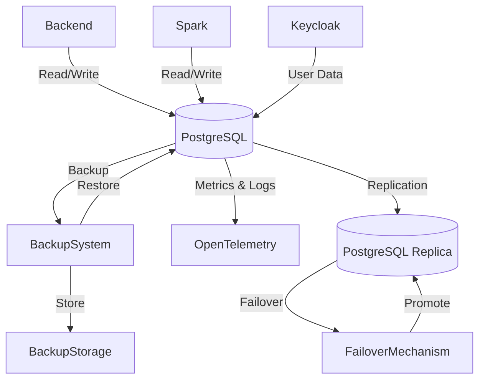

# Database Service Stack (PostgreSQL HA, Backup, Monitoring)

This directory contains the **high-availability PostgreSQL database stack** for the ETL platform, managed via Docker Compose and Docker Swarm. The stack provides:

- **Primary/Replica PostgreSQL nodes** (using Bitnami's repmgr for HA/failover)
- **HAProxy** for database connection failover
- **Automated backups**
- **Monitoring exporter**
- **pgAdmin** for database management

---

## Architecture Overview

The database layer is designed for reliability, observability, and ease of management:

- **PostgreSQL Master-Replica**: Two nodes (`pg-0`, `pg-1`) with streaming replication and automatic failover using repmgr.
- **HAProxy**: Provides a single endpoint for clients and handles failover between nodes.
- **Automated Backup**: Scheduled backups to local storage.
- **Monitoring**: `postgres-exporter` exposes metrics for Prometheus.
- **pgAdmin**: Web UI for DB management.

**Clients:**

- Keycloak (user auth)
- Backend application (business data)
- ETL pipeline (processed data)

---

## Services and Their Roles

### 1. `pg-0` (Primary Node)

Main PostgreSQL instance (Bitnami `postgresql-repmgr:15`). Handles write operations and replication to `pg-1`. Managed by repmgr for high-availability.

### 2. `pg-1` (Replica Node)

Standby PostgreSQL instance (Bitnami `postgresql-repmgr:15`). Receives streaming replication from `pg-0` and is promoted to primary if `pg-0` fails.

### 3. `database` (HAProxy)

Load balancer for PostgreSQL connections. Routes client traffic to the current primary node and ensures seamless failover for applications.

### 4. `postgres-exporter`

Exposes PostgreSQL metrics for Prometheus monitoring. Useful for alerting and observability.

### 5. `pgadmin`

Web-based UI for managing PostgreSQL databases. Accessible on ports 5050 (HTTP) and 5051 (HTTPS). Uses Docker secrets for SSL certificates.

### 6. `backup`

Automated backup service (`prodrigestivill/postgres-backup-local`). Periodically dumps database contents to the `backups/` directory.

---

## Data Flow & High Availability (from Database Service Diagram)

**Explanation:**

- The **Database** service (PostgreSQL) is the central data store for all services.
- Backend, Spark, and Keycloak interact with the database for data storage and retrieval.
- Automatic backup and restore procedures are managed by the BackupSystem, which stores backups in BackupStorage.
- The database is replicated for high availability using PGReplica, with failover managed by a FailoverMechanism (HAProxy + repmgr).
- All database operations, backup, and HA events are monitored via the observability stack (metrics/logs sent to OpenTelemetry Collector, Prometheus, Loki).

---

## Volumes & Networks

- **database_data**: Persists primary node data
- **replica_data**: Persists replica node data
- **pgadmin_data**: Persists pgAdmin settings
- **etl_network**: Isolated overlay network for all database-related services

---

## Security & Best Practices

- Store credentials and SSL keys in Docker secrets and `.env` files (never commit secrets to git).
- Restrict network access to trusted services only.
- Regularly test backup and restore procedures.
- Monitor health and performance with Prometheus and Grafana.

---

## References

- [Bitnami PostgreSQL repmgr](https://github.com/bitnami/containers/tree/main/bitnami/postgresql-repmgr)
- [HAProxy](https://www.haproxy.org/)
- [pgAdmin](https://www.pgadmin.org/)
- [Postgres Exporter](https://github.com/prometheus-community/postgres_exporter)
- [Postgres Backup Local](https://github.com/prodrigestivill/docker-postgres-backup-local)
