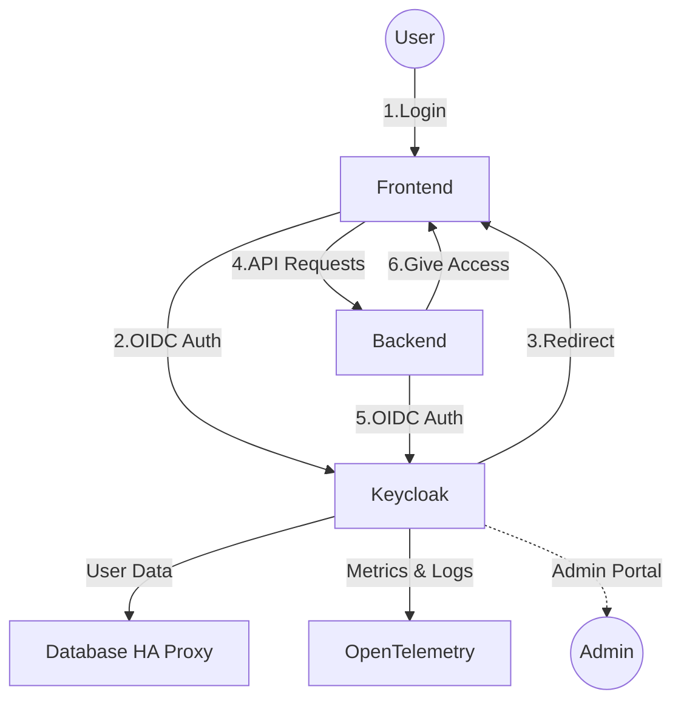

# Keycloak Service

Keycloak is the authentication and authorization provider for the ETL platform. It manages user identities, issues OIDC tokens, and integrates with the observability stack for monitoring and logging.

## Overview

- **Authentication & Authorization:** Centralized user management and SSO for all services.
- **Database Integration:** Stores user data in PostgreSQL (via HAProxy for HA).
- **Observability:** Exposes metrics and logs to OpenTelemetry, Prometheus, Loki, and Grafana.
- **Admin Portal:** Provides a web UI for user and role management.

## Architecture

- Runs as a Docker container on the `etl_network` overlay network.
- Uses custom realms for different teams, imported at startup.
- Secured with SSL certificates (mounted as Docker secrets).
- Waits for the database to be ready before starting (via `wait-for-db.sh`).
- Logs are output in JSON format with service tags for centralized logging.

## Configuration

- **Environment:**
  - Environment variables are loaded from the shared `.env` file.
  - JVM options are set for performance and reliability.
- **Configs:**
  - Realm JSON files are mounted for import at startup.
  - Startup script (`wait-for-db.sh`) ensures DB readiness.
- **Secrets:**
  - SSL certificates are provided as Docker secrets for secure HTTPS.
- **Volumes:**
  - Custom themes can be mounted via the `keycloak_themes` volume.
- **Deployment:**
  - Runs as a single replica on worker nodes (can be scaled as needed).
  - Logging is configured for rotation and tagging.

## Service Diagram

## Key Features

- OIDC authentication for frontend and backend services
- Secure storage of user data in PostgreSQL
- Metrics and logs integration with observability stack
- Admin portal for user and role management
