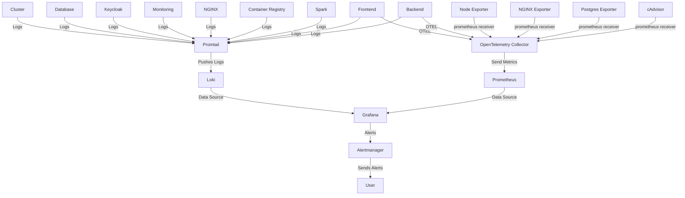

## Monitoring Service

This service provides full observability for the ETL platform, enabling metrics collection, log aggregation, visualization, and alerting. It is designed for production use with Docker Swarm and integrates with all core services.

### Components

- **Prometheus**: Collects and stores metrics from services and exporters.
- **Grafana**: Visualizes metrics and logs, and manages alerts.
- **Loki**: Aggregates and stores logs from all services.
- **Promtail**: Ships logs from hosts and containers to Loki.
- **OpenTelemetry Collector**: Receives, processes, and exports metrics and logs.
- **Alertmanager**: Handles alerts from Prometheus and Grafana.
- **Node Exporter**: Collects host-level metrics (CPU, memory, disk, etc.).
- **cAdvisor**: Collects container-level metrics.
- **NGINX Exporter**: Exposes NGINX metrics.
- **Postgres Exporter**: Exposes PostgreSQL metrics.

### Architecture Overview

#### Key Flows

- **Metrics**: Exporters and services send metrics to OpenTelemetry Collector, which forwards them to Prometheus. Grafana visualizes these metrics.
- **Logs**: Promtail collects logs from all services and hosts, sending them to Loki. Grafana visualizes logs from Loki.
- **Alerting**: Prometheus and Grafana send alerts to Alertmanager, which notifies users.

#### Deployment Notes

- All services run on the `etl_network` overlay network.
- Log and metric data is persisted using Docker volumes.
- Placement constraints ensure high availability and optimal resource usage.

#### Observability Stack

All core ETL services are monitored for health, performance, and logs. The stack enables:

- Centralized metrics and log storage
- Real-time dashboards and alerting
- Troubleshooting and root cause analysis
