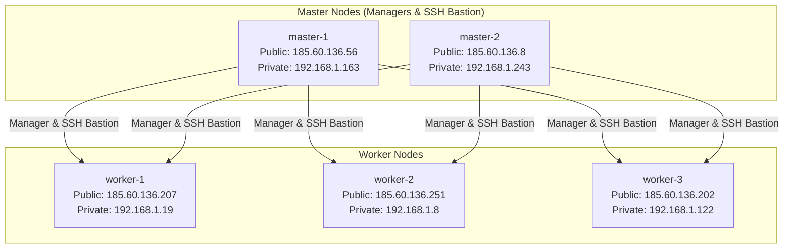

# Docker Swarm ETL Project Documentation

## Project Overview

This project implements a full-featured **ETL (Extract, Transform, Load) pipeline** using a Docker Swarm cluster. The architecture is designed for secure, scalable, and observable data operations, supporting modern DevOps practices and cloud-native standards.

### What is ETL?

**ETL** stands for **Extract, Transform, Load**—a process for moving and preparing data from various sources into a unified, structured format for analysis and further processing.

- **Extract:** Collect data from diverse sources (databases, files, web, etc.).
- **Transform:** Clean, validate, filter, and reshape data to meet business requirements.
- **Load:** Store processed data in a target system (e.g., PostgreSQL database).

## Architecture Overview

The ETL platform is deployed on a **Docker Swarm** cluster with the following components:

- **Master Nodes (SSH Bastion & Managers):**  
  - Serve as Swarm managers and SSH bastion hosts, providing secure access and orchestration.
  - Have public IPs for external access and private IPs for internal cluster communication.
- **Worker Nodes:**  
  - Run application workloads (containers for frontend, backend, Spark, Keycloak, etc.).
  - Use private IPs for secure, internal communication.

### Node Inventory

| Name      | OS         | Status | Package        | IP Address           |
|-----------|------------|--------|----------------|----------------------|
| worker-3  | Debian-12  | Active | B2-medium-03   | 185.60.136.202 (public), 192.168.1.122 (private)    |
| worker-2  | Debian-12  | Active | B2-medium-03   | 185.60.136.251 (public), 192.168.1.8 (private)       |
| worker-1  | Debian-12  | Active | B2-medium-03   | 185.60.136.207 (public), 192.168.1.19 (private)       |
| master-2  | Debian-12  | Active | S1-small-01    | 185.60.136.8 (public), 192.168.1.243 (private) |
| master-1  | Debian-12  | Active | S1-small-01    | 185.60.136.56 (public), 192.168.1.163 (private)  |

### Architecture Diagram

## ETL Pipeline Stages

### 1. Data Extraction

- Users (with appropriate roles) upload datasets (CSV files) via the frontend.
- Data is validated and stored in PostgreSQL tables.
- Role-based access control (RBAC) ensures only authorized users can upload, view, or modify data.

### 2. Data Transformation

- Users design data pipelines using a web UI, arranging filter and aggregation plugins.
- Each plugin can be previewed, and the output is shown at each step.
- Transformations are executed using **Apache Spark** for scalable, distributed processing.
- SparkSQL code is generated dynamically for each pipeline.

### 3. Data Loading

- Transformed data is loaded into PostgreSQL for persistent storage.
- Users can view, rename, delete tables and columns, depending on their role.
- Automatic backups and restore procedures are implemented for production data.

## Authentication & Authorization

- **Keycloak** is used for user management, authentication, and RBAC.
  - Users are created by administrators and assigned dynamic roles (System Administrator, Data Manager, Analyst).
  - Keycloak provides SSO (Single Sign-On) for all services (frontend, backend, Spark, Grafana).
  - Password management and role changes are supported via the user profile page.

## Observability & Monitoring

- **OpenTelemetry** is integrated for collecting metrics and logs from all services.
- **Prometheus** and **Grafana** provide dashboards for monitoring system health, data pipeline status, and resource usage.
- **Loki** is used for log aggregation.
- Alerts are configured for unusual activity and system failures.

## Security & Best Practices

- All communication (including Keycloak and API endpoints) uses **HTTPS/SSL** for security.
- Uploaded data is validated and sanitized to prevent vulnerabilities (e.g., DoS attacks).
- File size and upload limits are enforced.
- Regular automated backups and restore tests are performed.
- Role-based access control is strictly enforced for all database and pipeline operations.

## Automation & CI/CD

- **Ansible** automates server provisioning and configuration management.
- **CI/CD pipelines** (GitHub Actions, Jenkins, or GitLab CI) automatically build, test, and deploy Docker images.
- Kubernetes manifests are prepared for future cloud-native deployments.

## Platform & Infrastructure

- **Docker Swarm** orchestrates containers across manager and worker nodes.
- Master nodes act as SSH bastion hosts for secure access and automation.
- Custom SSH configuration enables seamless access for automation tools.
- PostgreSQL is used for reliable, scalable data storage.

## Common Pitfalls & Practical Tips

- Always validate and sanitize uploaded data.
- Limit file size and number of uploads to prevent abuse.
- Use role-based access control for all operations.
- Regularly back up your database and test recovery procedures.
- Monitor system performance and set alerts for unusual activity.
- Never expose confidential client secrets in frontend code.
- Use separate environments for development, test, and production.

## Follow-Up Learning Resources

- [Keycloak Documentation](https://www.keycloak.org/documentation)
- [Apache Spark Documentation](https://spark.apache.org/docs/latest/)
- [OpenTelemetry](https://opentelemetry.io/docs/)
- [Prometheus](https://prometheus.io/docs/introduction/overview/)
- [Grafana](https://grafana.com/docs/)
- [Docker Swarm](https://docs.docker.com/engine/swarm/)
- [Ansible](https://docs.ansible.com/)
- [PostgreSQL](https://www.postgresql.org/docs/)

---
